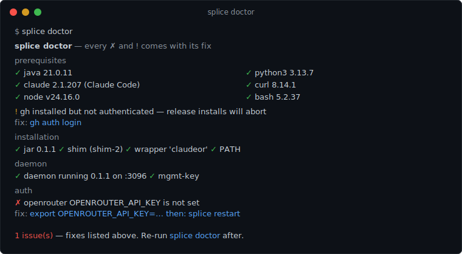
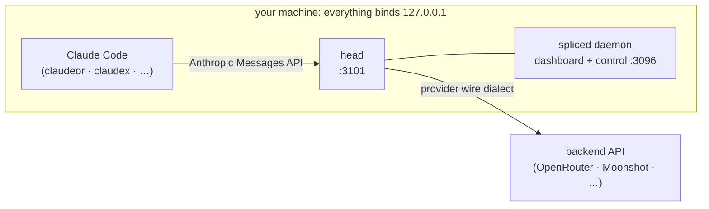

<div align="center">

# splice

**Type `claudex` instead of `claude` — [Claude Code](https://docs.anthropic.com/en/docs/claude-code) on your ChatGPT, Grok, or Kimi subscription, on loopback.**

[Install](#install) · [Quick start](#quick-start) · [How it works](#how-it-works) · [Providers](#provider-support) · [Trade-offs](#why-you-might-not-want-splice) · [Changelog](CHANGELOG.md) · [Security](SECURITY.md)

[](https://github.com/torad-labs/splice/actions/workflows/ci.yml)
[](https://github.com/torad-labs/splice/releases/latest)
[](https://github.com/torad-labs/splice/attestations)
[](LICENSE)

</div>

splice is a local, loopback-only proxy stack. A single Kotlin daemon (**spliced**) sits between Claude Code and one or more model backends, translating Anthropic's Messages API into each backend's own wire dialect. Each backend is exposed as a **head** — a thin Claude Code wrapper on its own loopback port (`claudex`, `claude-grok`, `claude-kimi`, `claudeor`, …). Its load-bearing feature is the **mirror**: the backend's reasoning summary is written back into the transcript as visible text, so conclusions persist and stay legible turn after turn instead of evaporating.

## Not affiliated

> [!IMPORTANT]
> splice is an independent, personal project. It is **not affiliated with, endorsed by, or sponsored by** Anthropic, OpenAI, xAI, Moonshot, or OpenRouter. All product names and trademarks belong to their respective owners.
> Anthropic identifies routing Claude Code to non-Claude models through a custom gateway as **unsupported**. splice is exactly that kind of gateway; use it with that in mind, at your own risk. No warranty: see [License](#license), and [why you might not want splice](#why-you-might-not-want-splice).

When something is wrong, `splice doctor` names the exact fix:



## Why it exists

Long coding-agent sessions bleed tokens and lose the thread. splice goes after both:

- **The prompt cache stays warm.** A stable cache key and **compaction that runs on the session's own model and reasoning effort** keep the cache warm across a long session. Opaque encrypted reasoning-item replay is an explicit, default-off trade-off: it can add cache warmth, but measurements showed it also made fresh reasoning substantially thinner. A mismatched compaction model *or* effort silently invalidates the cache and re-reads the entire transcript uncached.
- **Reasoning continuity is load-bearing.** The mirror preserves the provider-generated readable reasoning summary in the transcript, so both the agent and you can inspect the summary and carry that context through later turns and compaction. It is not raw, private, or exact chain-of-thought.
- **One instrument panel for the fleet.** The daemon serves a single dashboard over every head: live status, start/stop/restart, layered config with provenance, per-head 5-hour usage soft-warnings, auth, and logs.

What you get:

- [x] A [wrapper command per backend](#quick-start): `claudex`, `claude-grok`, `claude-kimi`, `claudeor`
- [x] The reasoning **mirror**: [summaries survive turns and compaction](#reasoning)
- [x] Cache-warm compaction on the session's own model and effort
- [x] A [fleet dashboard](#quick-start) on loopback: status, config with provenance, usage soft-warnings, logs
- [x] [`splice doctor`](#troubleshooting): every failing check prints the command that fixes it
- [x] [Checksummed **and** provenance-attested releases](#install), verified by the installer before anything goes live
- [x] New backends are [a TOML edit](#provider-support): the daemon dispatches on `(dialect, auth.kind)`

## How it works



Each wrapper is an `argv[0]` symlink to the shared launch shim `bin/splice-launch`: it cold-starts the daemon if needed, asks it for an exec recipe over the loopback control plane, and execs the real `claude` pointed at the head's port. Only the head talks to the backend; the dashboard and every control endpoint are bearer-guarded and loopback-only. Adding a backend is a TOML edit, not code. See [`config/splice.example.toml`](config/splice.example.toml) for the full sample topology.

## Requirements

**Platforms:** Linux and macOS natively; **Windows via WSL2** (run `wsl --install` in PowerShell
once, then do everything below inside the WSL shell; it behaves exactly like Linux). Native
Windows shells are refused by the installer with the same guidance: the launch shim and daemon
are Unix programs.

| Dependency | Why | If missing |
| --- | --- | --- |
| **Java 21+** | the spliced daemon ships as a fat jar | `apt install openjdk-21-jre-headless` · `brew install --cask temurin@21` · [adoptium.net](https://adoptium.net) |
| **Node 24** | Claude Code's own runtime | [nodejs.org](https://nodejs.org) or `nvm install 24` |
| **Claude Code** | splice wraps it — `claude` must resolve on PATH | `npm install -g @anthropic-ai/claude-code` |
| **Python 3** | the launch shim parses the daemon's JSON launch recipe | `apt install python3` · preinstalled on macOS |
| **curl** + **bash** | the launch shim and installer | preinstalled almost everywhere |
| **GitHub CLI, authenticated** | release installs verify build-provenance attestations via the GitHub API | `gh auth login` once ([cli.github.com](https://cli.github.com)); building from a checkout does not need it |

You don't have to pre-check any of this: `install.sh` verifies every dependency up front, prints
the exact fix for your machine's package manager, and, on an interactive terminal, offers to
run each fix for you (always with consent). `splice doctor` re-verifies everything at any time.

## Install

**Option 1: the release one-liner.** Verifies checksums *and* GitHub build-provenance
attestations before anything goes live, so authenticate `gh` once first:

```bash
gh auth login   # once
curl -fsSL https://github.com/torad-labs/splice/releases/latest/download/install.sh | bash
```

**Option 2: from source** (no `gh` needed):

```bash
git clone https://github.com/torad-labs/splice.git
cd splice
./install.sh
```

**Option 3: let your agent do it.** Give this prompt to any coding agent with shell access:

```text
Install splice (https://github.com/torad-labs/splice) on this machine and verify it works:
1. Check prerequisites: bash, curl, python3, Java 21+, Node 24, and Claude Code
   (`claude` on PATH). Install anything missing with this machine's package manager —
   show me each install command and ask before running it.
2. Install from source: `git clone https://github.com/torad-labs/splice && cd splice
   && ./install.sh` (or, if `gh auth status` shows I'm authenticated, use the release
   one-liner from the README instead).
3. Make sure ~/.local/bin is on my PATH (add it to my shell rc if not).
4. Ask me for an OpenRouter API key (I can create one at https://openrouter.ai/keys),
   export it as OPENROUTER_API_KEY, then run `splice setup`.
5. Run `splice doctor` and fix anything it flags — every failing check prints its own
   fix command. Repeat until it reports no blockers.
6. Tell me it's ready and that `claudeor` launches Claude Code through OpenRouter.
```

The agent can drive that loop for the same reason you can: `splice doctor` prints the fix for
every failing check.

## Quick start

```bash
export OPENROUTER_API_KEY="…"     # vendor-issued pay-per-token API key
splice setup                      # write the supported API-key starter and install wrappers
claudeor                          # Claude Code through OpenRouter on loopback (:3101)
```

`install.sh` builds the fat jar from a checkout (or fetches a release), installs the shared launch shim, links the wrapper commands into `~/.local/bin`, and finishes by running `splice doctor`, so the install ends with a checked report.

**Have a ChatGPT, Grok, or Kimi subscription? That's what splice was built for.** Copy the matching provider and head from [`config/splice.example.toml`](config/splice.example.toml) into `~/.config/splice/splice.toml`, run `splice install --all`, then sign in with that head's `login` command (`claudex login`, `claude-grok login`, `claude-kimi login`). These routes are unofficial: they reuse each vendor's own CLI OAuth client identity, which no vendor documents for third parties. Use them at your own risk; the API-key starter above is the zero-config alternative.

Admin verbs go through the `splice` command:

```bash
splice status         # per-head status
splice doctor         # check the whole install; every failing check prints its fix
splice restart        # restart the daemon with this shell's environment
splice dashboard      # open the control dashboard (loopback :3096)
splice init           # write the supported OpenRouter API-key starter topology
splice install --all  # (re)link the wrapper commands
<head> login          # sign in a subscription head (claudex, claude-grok, claude-kimi)
```

The dashboard and every control endpoint are bearer-guarded and loopback-only. The unlock key lives at `~/.claude-codex/state/mgmt-key`.

## Troubleshooting

`splice doctor` checks prerequisites, install integrity, config, daemon, and auth, then prints
the exact fix under every failing check.

The daemon reads API-key env vars from **its own** environment. Export a key *after* the daemon
has started and the shell sees it but the daemon does not: launches warn, requests fail upstream. `splice restart` restarts the daemon with your current
shell's environment; `splice doctor` detects this state explicitly.

## Credential locations

Each of these is a **password-equivalent secret**: anything that can read the file (or the environment variable) can spend against your account. Keep files `600`, never commit them, never paste them.

| Backend / route | Auth kind | Location | Notes |
| --- | --- | --- | --- |
| codex (ChatGPT) | `chatgpt-oauth` | `~/.codex/auth.json` | OAuth tokens — password-equivalent |
| grok (xAI) | `grok-oauth` | `~/.grok/auth.json` | OAuth tokens — password-equivalent |
| kimi (Moonshot) | `kimi-oauth` | `~/.kimi/credentials/kimi-code.json` | device-flow token — password-equivalent |
| OpenRouter | `api-key` | `$OPENROUTER_API_KEY` (env) | API key — password-equivalent |
| Moonshot (pay-per-token) | `api-key` | `$MOONSHOT_API_KEY` (env) | API key — password-equivalent |
| splice control plane | — | `~/.claude-codex/state/mgmt-key` | dashboard/API unlock key — password-equivalent |

## Provider support

| Route | Auth | Status |
| --- | --- | --- |
| OpenRouter | `api-key` (`OPENROUTER_API_KEY`) | **Supported** — pay-per-token, any OpenAI-compatible vendor |
| Moonshot | `api-key` (`MOONSHOT_API_KEY`) | **Supported** — pay-per-token Anthropic base |
| codex (ChatGPT) | `chatgpt-oauth` | **Primary** — what splice was built for; unofficial, at your own risk |
| grok (xAI) | `grok-oauth` | **Primary** — unofficial, at your own risk |
| kimi (Moonshot) | `kimi-oauth` | **Primary** — unofficial, at your own risk |

The **OAuth-identity** routes are the reason splice exists: they run Claude Code on the subscription you already pay for. They are also **unofficial**: they authenticate by reusing the public OAuth client identity of each vendor's own CLI, not a documented third-party integration, and a vendor could object or break them at any time. Use them at your own risk. The **api-key** routes are ordinary pay-per-token API access with none of that ambiguity, and make the best zero-config starter.

## Why you might not want splice

Reasons to walk away:

- **An unsupported gateway.** Anthropic identifies this class of tool as unsupported, and a Claude Code update can break splice at any time. The version handshake turns that into a loud failure instead of a corrupted session. It is still a failure.
- **Legally unsettled OAuth.** The Codex, Grok, and Kimi routes reuse each vendor's own CLI OAuth client identity. No vendor documents that reuse; it may violate terms of service, and a vendor could cut it off without notice. The primary routes are also the biggest risk.
- **Single-user by design.** There is no multi-user story, remote access, or TLS. A team wanting a shared model gateway should run one built for that job (LiteLLM, for example).
- **A JVM daemon.** Java 21 is a hard dependency, and the daemon holds a bounded 2 GB heap while serving. On a small machine that costs something.
- **A one-person project.** No warranty, no SLA. The release gates are strict: every release is checksummed, provenance-attested, and installed hermetically in CI before it ships. It is still one person.

## Backends and protocols

splice speaks several upstream wire dialects (`openai-responses`, `openai-chat`, `anthropic-passthrough`), selected per provider in the topology.

The codex backend at `https://chatgpt.com/backend-api/codex` is a **ChatGPT / Codex backend that speaks a Responses-STYLE protocol**: the internal endpoint the ChatGPT Codex product itself uses. It is **not the public OpenAI Responses API**, and nothing here should be read as targeting that public API.

## Reasoning

"Reasoning" here means one of three narrow things, never the model's raw private chain-of-thought:

- **Provider-generated reasoning summaries**: a short summary the backend itself produces and returns.
- **Readable reasoning fields**: supplied explicitly by the backend on the wire (e.g. `reasoning_text` / summary fields).
- **Opaque encrypted reasoning-item replay**: carrying the backend's own encrypted reasoning items forward into a later request, verbatim and unread.

splice never has, exposes, or reconstructs the model's raw chain-of-thought or exact reasoning. The **mirror** writes only the provider-generated summary text back into the transcript.

Replay ships off. Set `CLAUDEX_REPLAY_REASONING=1` only if you deliberately prefer additional replay/cache warmth over the deeper fresh reasoning observed with the mirror-only default.

## The cache-replay experiment

`experiments/cache-replay/` is a self-contained A/B that probes one question: **does replaying opaque encrypted reasoning items back into a request bust the prompt cache?** It runs a fixed multi-turn conversation twice, once carrying the encrypted reasoning items forward and once dropping them, and reports cached vs. uncached input tokens per turn.

- `real-ab.sh`: two isolated real Claude-Code sessions on a side-port, same turns, only the replay toggled.
- `run.mjs` / `replay-captured.mjs`: dependency-free Node harnesses; `replay-captured.mjs` replays a captured, sanitized transcript so the A/B is reproducible without live credentials.

The cache effect remains workload-dependent, but the reasoning-depth result was strong enough to make replay default-off: replay caused the model to reuse prior thinking, reducing output and making reasoning thin. Read `experiments/cache-replay/README.md` for the caveats and run it yourself.

## Layout

```
gateway/       Kotlin daemon (spliced) — Gradle multi-module, JDK 21; the PRIMARY stack
config/        splice.example.toml — the sample multi-provider topology
bin/           splice-launch (the installed wrapper) + legacy Node shims (claudex, claudex-next)
install.sh     fetch/build the jar, install the shim, link wrapper commands
webui/         React 19 + Vite + Zustand dashboard, single-file build
experiments/   cache-replay A/B reproducer
server/        LEGACY Node proxy stack — still runnable during cutover, not the primary path
.rules/        ast-grep "walls" enforced write-time AND at the commit gate (same rules twice)
```

The **gateway/** Kotlin daemon is the primary stack. The **server/** Node stack (and the `bin/claudex` / `bin/claudex-next` shims that drive it) is legacy, kept runnable during cutover but no longer the documented entry point.

## Development

```bash
npm ci
npm run gate   # Gradle, walls/hooks, server, webui, release acceptance, OSS checks
```

Contracts and invariants live in `AGENTS.md`; the change log in `CHANGELOG.md`; the wall doctrine in `.rules/README.md`.

## License

[MIT](LICENSE).
