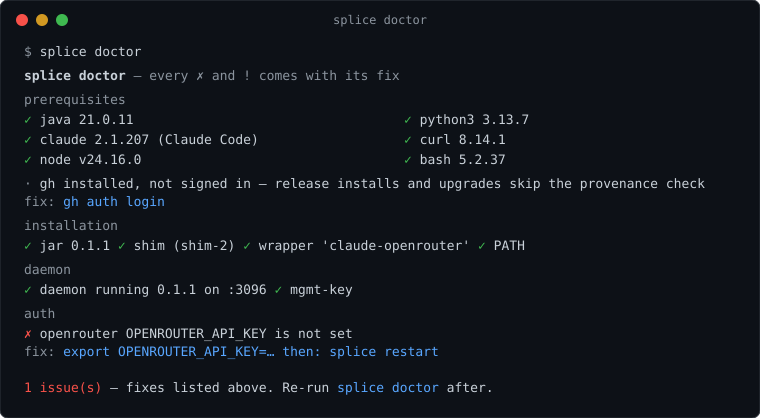
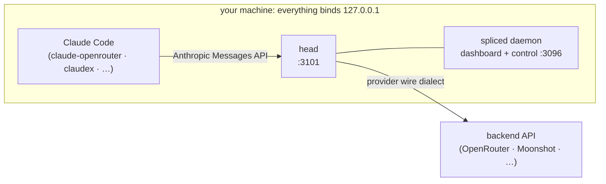

<div align="center">

# splice

**Use [Claude Code](https://docs.anthropic.com/en/docs/claude-code) with the models and subscriptions you already use.**

ChatGPT · Grok · Kimi · Muse · API backends · native Claude

[Why splice](#why-it-exists) · [Install](#install) · [Quick start](#quick-start) · [Providers](#provider-support) · [Trade-offs](#why-you-might-not-want-splice) · [Changelog](CHANGELOG.md) · [Security](SECURITY.md)

[](https://github.com/torad-labs/splice/actions/workflows/ci.yml)
[](https://github.com/torad-labs/splice/releases/latest)
[](https://github.com/torad-labs/splice/attestations)
[](LICENSE)

</div>

Type `claudex` instead of `claude` to work with a ChatGPT-backed model inside Claude Code. Use `claude-grok`, `claude-kimi` or `claude-muse` for those subscriptions, or connect an API backend such as OpenRouter. You keep Claude Code's tools, permission checks and terminal workflow; splice connects it to the backend you choose.

The gateway runs locally on your machine. Model requests still go to the chosen provider—this is not local model inference. Subscription connections are **unofficial**; API-key connections use ordinary pay-per-token access.

## Not affiliated

> [!IMPORTANT]
> splice is an independent, personal project. It is **not affiliated with, endorsed by, or sponsored by** Anthropic, OpenAI, xAI, Moonshot, Meta, or OpenRouter. All product names and trademarks belong to their respective owners.
> Anthropic identifies routing Claude Code to non-Claude models through a custom gateway as **unsupported**. splice is exactly that kind of gateway; use it with that in mind, at your own risk. No warranty: see [License](#license), and [why you might not want splice](#why-you-might-not-want-splice).

## Why it exists

Choosing a different model shouldn't mean rebuilding your coding workflow around a different client. splice lets you keep Claude Code while working across backends—and makes those sessions useful together.

- **Use the subscriptions you already pay for.** Connect ChatGPT, Grok or Kimi through dedicated commands, or choose a pay-per-token API route. [Provider support](#provider-support) spells out the differences and the risks.
- **Let different models work together.** A ChatGPT-backed session can find and message a Grok-backed session using Claude Code's own agent tools. [Shared session discovery](#heads-that-see-each-other) is enabled by default, with isolation available when you need it.
- **Spend less time recovering long sessions.** More reliable compaction means fewer interruptions and less repeated work. If the client disconnects, an identical compaction retry can pick up the work already underway. [How recovery works](#long-session-reliability).
- **See usage without leaving the session.** Provider-reported plan usage appears in Claude Code's status line. The [dashboard](#manage-your-sessions) brings connection status, usage warnings, configuration and logs together.
- **Get a fix, not just an error.** [`splice doctor`](#troubleshooting) checks the installation, configuration and authentication, and prints the remedy for each failing check. Release installs verify checksums and build provenance before going live.

### A workflow across models

After configuring and signing in to the matching providers, open each command in a separate terminal:

```bash
claudex       # Claude Code using your ChatGPT subscription
claude-grok   # Claude Code using your Grok subscription
```

For example, ask one session to implement a change and the other to review it. They can discover each other with `ListAgents` and exchange findings with `SendMessage`; you don't have to copy messages between terminals. Each session still uses Claude Code's own tools and permissions.

Each named backend connection is called a **head**. You choose which heads to configure and launch; the commands above do not configure providers for you.

**In [v0.3.1](https://github.com/torad-labs/splice/releases/tag/v0.3.1):** more reliable compaction, plus an optional [JavaScript tool runner](#beta-code-mode-for-chatgpt) that lets the model coordinate several client tools in one script. The runner is an opt-in beta, not a requirement for using splice.

## Install

The release installer checks your prerequisites, verifies checksums and GitHub build-provenance attestations, and finishes with `splice doctor`.

### Requirements

**Platforms:** Linux and macOS natively; **Windows via WSL2** (run `wsl --install` in PowerShell
once, then do everything below inside the WSL shell; it behaves exactly like Linux). Native
Windows shells are refused by the installer with the same guidance: the launch shim and daemon
are Unix programs.

| Dependency | Why | If missing |
| --- | --- | --- |
| **Java 21+** | the spliced daemon ships as a fat jar | `apt install openjdk-21-jre-headless` · `brew install --cask temurin@21` · [adoptium.net](https://adoptium.net) |
| **Node 24** | Claude Code's own runtime | [nodejs.org](https://nodejs.org) or `nvm install 24` |
| **Claude Code** | splice wraps it — `claude` must resolve on PATH | `npm install -g @anthropic-ai/claude-code` |
| **Python 3** | the launch shim parses the daemon's JSON launch recipe | `apt install python3` · preinstalled on macOS |
| **curl** + **bash** | the launch shim and installer | preinstalled almost everywhere |
| **GitHub CLI, authenticated** | release installs verify build-provenance attestations via the GitHub API | `gh auth login` once ([cli.github.com](https://cli.github.com)); building from a checkout does not need it |

You don't have to pre-check any of this: `install.sh` verifies every dependency up front, prints
the exact fix for your machine's package manager, and, on an interactive terminal, offers to
run each fix for you (always with consent). `splice doctor` re-verifies everything at any time.

### Install a release

Authenticate the GitHub CLI once so the installer can verify build provenance:

```bash
gh auth login   # once
curl -fsSL https://github.com/torad-labs/splice/releases/latest/download/install.sh | bash
```

To pin one version instead of following `latest` (prereleases never become `latest`):

```bash
curl -fsSL https://github.com/torad-labs/splice/releases/download/v0.3.2/install.sh \
  | env SPLICE_VERSION=v0.3.2 bash
```

**Upgrading.** `splice upgrade` fetches and verifies the latest release the same way (or one
version with `--to vX.Y.Z`), stages it beside the current one under
`~/.local/share/splice/releases/`, waits for every head's in-flight turns to finish (`--now` skips
the wait), repoints the live jar, restarts the daemon and runs doctor. A launch shim you edited is
kept and its diff printed. `splice upgrade --rollback` puts the previous release back; it is kept
until the next successful upgrade. Config and credentials are never touched.

<details>
<summary>Other installation options: from source or with a coding agent</summary>

**From source** (no `gh` needed):

```bash
git clone https://github.com/torad-labs/splice.git
cd splice
./install.sh
```

**Let your agent do it.** Give this prompt to any coding agent with shell access:

```text
Install splice (https://github.com/torad-labs/splice) on this machine and verify it works:
1. Check prerequisites: bash, curl, python3, Java 21+, Node 24, and Claude Code
   (`claude` on PATH). Install anything missing with this machine's package manager —
   show me each install command and ask before running it.
2. Install from source: `git clone https://github.com/torad-labs/splice && cd splice
   && ./install.sh` (or, if `gh auth status` shows I'm authenticated, use the release
   one-liner from the README instead).
3. Make sure ~/.local/bin is on my PATH (add it to my shell rc if not).
4. Ask me for an OpenRouter API key (I can create one at https://openrouter.ai/keys),
   export it as OPENROUTER_API_KEY, then run `splice setup`.
5. Run `splice doctor` and fix anything it flags — every failing check prints its own
   fix command. Repeat until it reports no blockers.
6. Tell me it's ready and that `claude-openrouter` launches Claude Code through OpenRouter.
```

The agent can drive that loop for the same reason you can: `splice doctor` prints the fix for
every failing check.

</details>

## Quick start

### API-key starter: OpenRouter

This is the zero-config provider path. It uses a paid API key, not a subscription allowance.

```bash
export OPENROUTER_API_KEY="…"     # vendor-issued pay-per-token API key
splice setup                      # write the supported API-key starter and install wrappers
claude-openrouter                          # Claude Code through OpenRouter on loopback (:3101)
```

No export handy? There are two other ways to get the key in — both land in
`~/.config/splice/keys.toml` (0600), which every later daemon start reads from any shell:

- `claude-openrouter login` — a masked terminal prompt (the key never hits shell history, `ps`, or a
  session transcript).
- Inside a `claude-openrouter` session, while the key is missing, splice offers to capture it: paste the
  key as a **bare message** (nothing else in the text) and it is stored and blocked before it
  reaches the model — it never travels upstream. The session transcript still records the paste,
  so the masked `claude-openrouter login` stays the zero-trace path.

An explicit `OPENROUTER_API_KEY` in the daemon's environment always wins over the store.
`splice key set|list|unset` manages the store directly (`--stdin` for scripts).

### Subscription setup: ChatGPT, Grok, Kimi or Muse

These routes are **unofficial**. They reuse each vendor's own CLI OAuth client identity, which no vendor documents for third-party use. That reuse may violate terms of service, and a vendor could block it or change it without notice. Use these routes at your own risk.

1. Copy the matching provider and head from [`config/splice.example.toml`](config/splice.example.toml) into `~/.config/splice/splice.toml`.
2. Run `splice install --all` to install the wrapper commands.
3. Sign in with `claudex login`, `claude-grok login`, `claude-kimi login` or `claude-muse login`, then launch that same command without `login`.

If the daemon is already running, finish pending work before a full `splice restart` to load topology changes; a `context_window` edit needs none (see [Long-session reliability](#long-session-reliability)). A head restart alone does not reload TOML. splice keeps its own credentials; you don't need to share the vendor CLI's credential file. See [credential locations](#credential-locations).

### Native Claude

For Claude itself, `claude-splice` preserves Claude Code's native Anthropic login while routing through splice; splice stores no Claude credential. Use Claude Code's own `/login` inside that head.

## Manage your sessions

Use `splice dashboard` to see all heads in one place: live status, start/stop/restart controls, layered configuration with provenance, per-head usage soft-warnings, authentication and logs. These are local controls, not a hosted service.

Admin verbs go through the `splice` command:

```bash
splice status         # per-head status
splice doctor         # check the whole install; every failing check prints its fix
splice doctor --json  # the same as a redacted, shareable report (--with-logs, --out FILE, --live)
splice add <profile>  # add a provider + head without editing TOML (codex|grok|kimi|muse|claude|api-key)
splice upgrade        # verified upgrade to the latest release (--to vX, --now, --rollback)
splice sessions       # the Claude Code sessions on this machine, joined to their heads
splice perf           # per-head latency, failure and cache summary (--window 1h|24h|7d)
splice wire <head>    # the request bodies a head sent upstream — only once you opt that head in
splice trace <head>   # a head's full request/response trace from disk (--turn ID, --purge) — opt-in per head
splice restart        # restart the daemon with this shell's environment
splice dashboard      # open the control dashboard (loopback :3096)
splice init           # write the supported OpenRouter API-key starter topology
splice install --all  # (re)link the wrapper commands
<head> login          # sign in a subscription head (claudex, claude-grok, claude-kimi, claude-muse)
```

`splice add` asks only for what a profile cannot know (a base URL and models for a generic
OpenAI-compatible endpoint), signs in through the same flow as `login`, checks the candidate
before writing anything (the file parses, the credential is present, the endpoint answers, the
models are listed where the dialect lists them; `--live` adds one short turn) and appends the two
tables through a temp file and one rename, so a refused add leaves your file byte-identical.

The dashboard and every control endpoint are bearer-guarded and loopback-only. The unlock key lives at `~/.claude-codex/state/mgmt-key`.

### Plan usage in Claude Code

splice passes provider-reported usage into Claude Code's status line, including usage windows and reset times where available. Dashboard usage warnings are advisory; they do not block requests.

Subscription heads poll their own provider every five minutes while the daemon is running so usage can appear before the first turn. ChatGPT reads its usage endpoint, Kimi its usages endpoint, and Grok its billing endpoint, using that head's own credential. API-key and client-auth heads do not poll. Set `CLAUDEX_QUOTA_POLL=off` in the daemon's environment to disable polling, then restart the daemon after pending work finishes; usage can still arrive in each turn's rate-limit headers.

## Heads that see each other

Ask a session on one backend to get a review from a session on another. Both appear in Claude Code's `ListAgents`, and `SendMessage` carries the request and reply. This works across splice heads and plain `claude` sessions on the same machine.

Underneath, Claude Code discovers peers through a `sessions` directory. Without sharing that directory, each head's separate config would hide the other heads' sessions.

On the first launch of each head, splice links its `sessions` directory to the shared registry under `~/.claude/sessions`, creating that registry if plain `claude` has never run. That shared registry is what makes cross-head discovery possible.

There is nothing to configure. `sessions` is in the default `[claude].share` list. Put it in a head's `isolate` list to wall that head off, or remove it from `share` to turn the feature off everywhere. The fresh-machine e2e checks the link on both heads of a clean install.

## Troubleshooting

`splice doctor` checks prerequisites, install integrity, config, daemon, and auth, then prints
the exact fix under every failing check. `splice doctor --json` writes the same findings as a
report you can share: versions, the topology's shape (never a credential, an account id or a
working directory), every check with its fix, and the last perf rows; `--with-logs` appends the
last 500 daemon lines through the same redaction, `--out FILE` writes it. Nothing is uploaded.

`splice sessions` lists the Claude Code sessions on the machine with the head that launched each
one and whether it is live, stale or gone, plus the `SendMessage` line that reaches it.
`splice perf --window 24h` shows, per head, how long turns wait before the first byte and how long
they stream, the failure share by outcome, retries, cache hit ratio and peak concurrency.

When a session's Claude Code is newer than the version this splice release was tested with,
doctor, `splice status` and the status line say so once; equal or older is silent.



The daemon reads API-key env vars from **its own** environment. Export a key *after* the daemon
has started and the shell sees it but the daemon does not: launches warn, requests fail upstream. `splice restart` restarts the daemon with your current
shell's environment; `splice doctor` detects this state explicitly. Keys in
`~/.config/splice/keys.toml` sidestep the whole class: the store is re-read per request, so a
`claude-openrouter login` or `splice key set` lands on the next request, no restart required.

## Credential locations

Each of these is a **password-equivalent secret**: anything that can read the file (or the environment variable) can spend against your account. Keep files `600`, never commit them, never paste them.

Splice signs in on its own. Each OAuth head keeps its own credential file under `~/.config/splice/auth/`, written by `splice login <head>`, and it may be a different account from the one the vendor's own CLI or desktop app uses. The native apps' files (`~/.codex/auth.json`, `~/.grok/auth.json`, `~/.kimi/credentials/kimi-code.json`, `~/.config/muse/auth.json`) are never read unless you name one in `auth.file`. Sharing a file with the native app is a trap: a refresh rotates the refresh token, so the app and splice invalidate each other's session, and the head has no credential while the other side rewrites the file. `splice doctor` warns when a head still names one.

| Backend / route | Auth kind | Location | Notes |
| --- | --- | --- | --- |
| Claude (`claude-splice`) | `client` | Claude Code's native credential store | forwarded by Claude Code; splice stores no credential |
| codex (ChatGPT) | `chatgpt-oauth` | `~/.config/splice/auth/codex.json` | splice's own OAuth tokens (`splice login claudex`); `~/.codex/auth.json` only by explicit `auth.file` |
| grok (xAI) | `grok-oauth` | `~/.config/splice/auth/grok.json` | splice's own OAuth tokens (`claude-grok login`); `~/.grok/auth.json` only by explicit `auth.file` |
| kimi (Moonshot) | `kimi-oauth` | `~/.config/splice/auth/kimi.json` (+ `device_id` beside it) | splice's own device-flow token (`claude-kimi login`); the app's file only by explicit `auth.file` |
| muse (Meta) | `muse-oauth` | `~/.config/splice/auth/muse.json` | splice's own device-flow account token plus minted inference key (`claude-muse login`); the Muse Code CLI file only by explicit `auth.file` |
| OpenRouter | `api-key` | `$OPENROUTER_API_KEY` (env) or `~/.config/splice/keys.toml` | API key — password-equivalent |
| Moonshot (pay-per-token) | `api-key` | `$MOONSHOT_API_KEY` (env) or `~/.config/splice/keys.toml` | API key — password-equivalent |
| splice api-key store | — | `~/.config/splice/keys.toml` (0600) | env wins over the store — password-equivalent |
| splice control plane | — | `~/.claude-codex/state/mgmt-key` | dashboard/API unlock key — password-equivalent |

### More than one account per provider

An OAuth head can hold several accounts of its kind and switch between them when one runs out.
`splice login <head>` without `--label` always signs in the primary account in the file above,
so a revoked primary is replaced in place; every further `splice login <head> --label <name>` lands
beside it under `~/.config/splice/auth/<kind>/<primary file>/<name>.json`, for the default primary
`chatgpt-oauth/codex.json/<name>.json` (its quota state in `<name>-quota.json`
next to it). `--label auto` derives the name from nothing personal: the ChatGPT plan plus a short
hash of the account id, or `grok-2`, `kimi-3` by ordinal. A file is only ever used by the provider
whose kind it carries inside; a mislabeled file is refused at boot, never silently used. A head
holding one account has no pool and behaves exactly as before: nothing extra on the status line,
in `splice status` or in `splice doctor`. Inside a head, `/login` signs in the primary and
`/login --label <name>` adds an account the same way; a `/login` while an earlier sign-in is still
waiting for its browser cancels that one and starts over.

The pool is yours to fill: every account in it must be one you own and are entitled to use under
that provider's terms, and a pool does not lift a plan's limits, it only lets a session continue
on another account you hold while one is exhausted. Sharing accounts, or pooling to get past
limits a business plan sets, is between you and the provider; splice does not arbitrate it.

Selection is sticky per session and decided only between turns. A session keeps the account it
last used until the provider reports that account exhausted (a window at 100 %, or a 429 whose
reset is later than a turn can wait); the next turn goes out on the pool account with the lowest
seven-day usage whose five-hour window is open, and the session returns to its primary at the
first turn after that account's reset time. A turn already streaming finishes on the account it
started on. The first turn after a switch pays one cold prompt-cache read, and its perf row says
so and names the account. When every account is out, the turn fails the way limits fail today
and names the earliest reset across the pool. The status line, `splice status` and `splice doctor`
name the account a head or session is on and the last switch with its reason; the daemon log
records each switch once under `[<head>]`.

## Provider support

| Route | Auth | Status |
| --- | --- | --- |
| Claude (`claude-splice`) | `client` (Claude Code native login) | **Primary** — Anthropic passthrough; splice stores no credential |
| OpenRouter | `api-key` (`OPENROUTER_API_KEY`) | **Supported** — pay-per-token, any OpenAI-compatible vendor |
| Moonshot | `api-key` (`MOONSHOT_API_KEY`) | **Supported** — pay-per-token Anthropic base |
| codex (ChatGPT) | `chatgpt-oauth` | **Primary** — what splice was built for; unofficial, at your own risk |
| grok (xAI) | `grok-oauth` | **Primary** — unofficial, at your own risk |
| kimi (Moonshot) | `kimi-oauth` | **Primary** — unofficial, at your own risk |
| muse (Meta) | `muse-oauth` | **Primary** — unofficial, at your own risk |
| Local runtimes (Ollama, LM Studio, vLLM) | `api-key` on a loopback `base_url` | **Supported** — user-managed; rows validated against what the runtime serves |

The **OAuth-identity** routes are the reason splice exists: they run Claude Code on the subscription you already pay for. They are also **unofficial**: they authenticate by reusing the public OAuth client identity of each vendor's own CLI, not a documented third-party integration, and a vendor could object or break them at any time. Use them at your own risk. The **api-key** routes are ordinary pay-per-token API access with none of that ambiguity, and make the best zero-config starter.

### Local models

A provider on a loopback `base_url` (Ollama at `http://localhost:11434/v1`, LM Studio at
`http://localhost:1234/v1`, vLLM at `http://localhost:8000/v1`) is treated as local: splice never
downloads a model or manages the runtime, but at boot and in `splice doctor` it asks the runtime
what it serves and refuses a row the runtime does not list or that declares more context than the
runtime serves, with the runtime's own words (`declares context_window 65536, runtime serves
32768`). The refused head is reported DEGRADED while the rest of the daemon serves; a runtime
that is down boots as before and fails per turn. `splice doctor --live` adds one tiny streamed
request with one tool per listed model, so tool calling and streaming are proven before a session
depends on them. Status and doctor label these heads `local runtime` and never imply subscription
or quota state. Set `local = false` on a provider to opt out of the loopback rule, `local = true`
to force it elsewhere. A local head also asks its runtime for token counts, which is what makes
Claude Code's context meter move and its auto-compaction fire; a runtime that refuses that request
field takes `quirks = { stream_usage = false }`. A local head also asks its runtime for token counts, which is what makes
Claude Code's context meter move and its auto-compaction fire; a runtime that refuses that request
field takes `quirks = { stream_usage = false }`. See [`checks/local-models/README.md`](checks/local-models/README.md) for
what each runtime reports and how it was tested.

### Shared MCP hosting

Every Claude Code session normally starts its own copy of every stdio MCP server in its config.
splice starts each such server once, in the daemon, and serves it to every session over
Streamable HTTP on loopback: each head's `.claude.json` is rewritten to point at the hosted URL
while your own config file is never edited. A server whose command names a project directory or
that depends on client roots keeps launching per session (its reason is on `/api/mcp`); a hosted
server runs in your home directory, so one that reads its working directory without naming it
(`mcp-server-git` with no `--repository`) belongs in `mcp_hosting_exclude`;
`http`/`sse`/`ws` servers pass through untouched. Hosted servers start on first use, are reaped
when idle and evicted under memory pressure; a crash fails the pending calls honestly and the next
call restarts the server. `[daemon] mcp_hosting = false` turns hosting off,
`mcp_hosting_exclude = ["name"]` keeps named servers per session.

Hosting itself still rewrites only your one global `~/.claude.json`; `/api/mcp`'s `sources`
section additionally censuses the other four places a server can be declared on this box (a
project-scoped override inside `.claude.json`, a repo's own `.mcp.json`, and a plugin's own
`.mcp.json` or inline `plugin.json`) so you can see what is not hosted and why, even though
splice does not rewrite those kinds yet.

### Compaction instructions

`[compaction]` in `splice.toml` adds your own instructions to Claude Code's compaction requests,
globally, per upstream model (`[[compaction.model]]`) or per project directory
(`[[compaction.project]]`, optionally per model). The most specific scope replaces the others;
`instructions = ""` opts a scope out. The text rides after Claude Code's own summarizer prompt on
compaction requests only, so the cached request prefix is byte-identical with and without it, and
`/api/compact` shows the effective text and where it came from.

### Per-head system prompt

`system_prompt` under `[heads.<key>]` gives that head standing instructions on **every** turn —
inline text, or `system_prompt_file = "~/path"` (never both; both present is a config error at
load, as is a file that cannot be read). Absent, or `""`, is exactly today's bytes.

`system_prompt_mode` picks the seam. `"append"` is the default: your text is placed beside Claude
Code's own system field, so the client's bytes ride through untouched, every existing
`cache_control` breakpoint survives, and the prompt cache still hits from turn two.
`"replace"` substitutes that whole field instead — and Claude Code ships its **entire operating
instruction set** in it, so a `replace` head behaves like a bare model with tools attached. That is
a deliberate choice, not a mistake, so `splice doctor` warns about it rather than refusing it; use
it on a head you drive yourself. Two heads with different prompts never leak into each other.

### Code mode for ChatGPT

Code mode is **on by default** for Claudex-compatible providers (`auth.kind = "chatgpt-oauth"`,
`dialect = "openai-responses"`), including custom head names, and exclusive to them. It rides the
same unofficial ChatGPT OAuth route and carries the same terms caveat: use it at your own risk. To
turn it off, in the provider's existing quirks section:

```toml
[providers.codex.quirks]
code_mode = false # true or omitted enables both runner and guidance on Claudex-shaped providers
```

When on, it automatically appends orchestration guidance to the caller's instructions and exposes splice's bundled JavaScript runner on eligible GPT-6 Astra/Sol turns. Compaction, toolless turns, and forced named-tool choices keep the ordinary path. Direct tools remain available; all real operations use Claude Code's permission-checked client handlers. No Codex or Node installation is required. Child JVMs bound workers, time, and heap and deny guest host/I/O access; Graal community is not an OS-hardened sandbox against same-user attackers.

Four scripts can be paused at once, each in its own worker JVM. A paused script whose client calls go unanswered for 30 minutes is closed, and when all four slots are held the oldest one paused over 2 minutes is evicted for a newer script; a script that cannot get a slot reports that in its own output so the model calls the tools directly. A closed script is never rerun; its evidence (results so far, unresolved calls, the reason) is what the model sees. That evidence is bounded only by the 1 MiB output ceiling; past it, each result is cut to an equal share behind a `[truncated N chars]` marker rather than the turn failing. A code-mode failure that no retry can change ends the turn with a readable `⚠ splice:` line instead of an API error, because Claude Code either retries error events identically or hides their message once content has streamed.

If a completed script's history can no longer be placed (the record aged out, the session switched model, the conversation moved underneath a running script), splice sends the client's own history upstream instead, where the script's client calls are ordinary tool calls, and logs one `[code-mode]` line for the head. The conversation continues; only that script's batching is lost from the model's view.

Every head using that provider shares the setting, and it is read only when the daemon boots: finish ongoing work, edit TOML, then run `splice restart` for a **full daemon restart**. A head restart alone does not reload TOML. Finish code-mode work before toggling or restarting: pending JavaScript execution cannot survive a daemon restart, and splice never reruns the lost source automatically.

A single tool result larger than the runner's 64 KiB text frame is truncated at admission behind a `[truncated N chars]` marker and the turn completes. In a bounded real-Astra test on synthetic tasks, guidance improved batching without reducing graded correctness. That is not a guarantee of better output or less redundant investigation on arbitrary projects.

## Why you might not want splice

Reasons to walk away:

- **An unsupported gateway.** Anthropic identifies this class of tool as unsupported, and a Claude Code update can break splice at any time. The version handshake makes the break loud instead of corrupting a session mid-turn.
- **Legally unsettled OAuth.** The Codex, Grok, and Kimi routes reuse each vendor's own CLI OAuth client identity. No vendor documents that reuse; it may violate terms of service, and a vendor could cut it off without notice. The primary routes are also the biggest risk.
- **Single-user by design.** There is no multi-user story, remote access, or TLS. A team wanting a shared model gateway should run one built for that job (LiteLLM, for example).
- **A JVM daemon.** Java 21 is a hard dependency, and the daemon holds a bounded 2 GB heap while serving.
- **A one-person project.** No warranty, no SLA. The release gates are strict: every release is checksummed, provenance-attested, and installed hermetically in CI before it ships. It is still one person.

## How it works

A single Kotlin daemon (**spliced**) runs between Claude Code and the configured model backends. Each head is a thin Claude Code wrapper on its own loopback port. splice translates Anthropic's Messages API into each provider's wire dialect; Claude Code remains the tool executor.


```mermaid
flowchart LR
    subgraph machine["your machine: everything binds 127.0.0.1"]
        CC["Claude Code<br/>(claude-openrouter · claudex · …)"]
        HEAD["head<br/>:3101"]
        D["spliced daemon<br/>dashboard + control :3096"]
        CC -- "Anthropic Messages API" --> HEAD
        HEAD --- D
    end
    HEAD -- "provider wire dialect" --> API["backend API<br/>(OpenRouter · Moonshot · …)"]
```

Each wrapper is an `argv[0]` symlink to the shared launch shim `bin/splice-launch`: it cold-starts the daemon if needed, asks it for an exec recipe over the loopback control plane, and execs the real `claude` pointed at the head's port. Only the head talks to the backend; the dashboard and every control endpoint are bearer-guarded and loopback-only. Adding a backend using an existing dialect and auth kind is a TOML edit, not code. See [`config/splice.example.toml`](config/splice.example.toml) for the full sample topology.

`install.sh` builds the fat jar from a checkout (or fetches a release), installs the shared launch shim, links the wrapper commands into `~/.local/bin`, and finishes by running `splice doctor`.

### Long-session reliability

Compaction uses the session's own model and reasoning effort and preserves its request shape. A stable prompt-cache key and unchanged prefixes support cache reuse, but the actual cache result depends on the backend and workload. Opaque reasoning replay is a separate, default-off trade-off described [below](#the-cache-replay-experiment).

A client disconnect during compaction detaches that client rather than cancelling the upstream work. A byte-identical retry can follow the running turn or receive its recorded result without starting a second upstream turn. This is compaction recovery, not a promise to replay arbitrary tool executions. Stopping a head ends compactions still running on it.

A `context_window` edit in `splice.toml` needs no restart. The running daemon re-reads the windows (a model's `context_window`, `extra_windows`, `window_rules`, `default_context_window` and a head's `context_window`) when the file changes. Running sessions compact at the new window through usage scaling, and the next launch plants it. A local runtime is asked about a new window first and a window it refuses is not applied; a file that does not parse keeps the windows in force. The daemon log names what moved, or why nothing did. Every other key is still read only at boot, and `splice doctor` reports the file stale until `splice restart`.

During upstream silences, splice sends SSE keepalives so Claude Code can distinguish an open stream from a stalled connection. Optional progress messages identify themselves as splice-authored status, never model reasoning. Failed or truncated streams remain failures rather than being presented as finished answers.

## Backends and protocols

splice speaks several upstream wire dialects (`openai-responses`, `openai-chat`, `anthropic-passthrough`), selected per provider in the topology.

The codex backend at `https://chatgpt.com/backend-api/codex` is a **ChatGPT / Codex backend that speaks a Responses-STYLE protocol**: the internal endpoint the ChatGPT Codex product itself uses. It is **not the public OpenAI Responses API**, and nothing here should be read as targeting that public API.

## Reasoning

"Reasoning" here means one of three narrow things, never the model's raw private chain-of-thought:

- **Provider-generated reasoning summaries**: a short summary the backend itself produces and returns.
- **Readable reasoning fields**: supplied explicitly by the backend on the wire (e.g. `reasoning_text` / summary fields).
- **Opaque encrypted reasoning-item replay**: carrying the backend's own encrypted reasoning items forward into a later request, verbatim and unread.

splice never has, exposes, or reconstructs the model's raw chain-of-thought or exact reasoning. Provider-native readable fields may be displayed as thinking blocks, but `mirror_reasoning` is locked off after every configuration layer: TOML, state, environment variables, and runtime PATCH cannot enable a synthetic transcript summary.

Opaque replay also ships off. Set `CLAUDEX_REPLAY_REASONING=1` only if you deliberately prefer additional replay/cache warmth over the deeper fresh reasoning observed without replay.

## The cache-replay experiment

`experiments/cache-replay/` is a self-contained A/B that probes one question: **does replaying opaque encrypted reasoning items back into a request bust the prompt cache?** It runs a fixed multi-turn conversation twice, once carrying the encrypted reasoning items forward and once dropping them, and reports cached vs. uncached input tokens per turn.

- `real-ab.sh`: two isolated real Claude-Code sessions on a side-port, same turns, only the replay toggled.
- `run.mjs` / `replay-captured.mjs`: dependency-free Node harnesses; `replay-captured.mjs` replays a captured, sanitized transcript so the A/B is reproducible without live credentials.

The cache effect remains workload-dependent, but the reasoning-depth result was strong enough to make replay default-off: replay caused the model to reuse prior thinking, reducing output and making reasoning thin. Read `experiments/cache-replay/README.md` for the caveats and run it yourself.

## Layout

```
gateway/       Kotlin daemon (spliced) — Gradle multi-module, JDK 21; the PRIMARY stack
config/        splice.example.toml — the sample multi-provider topology
bin/           splice-launch (the installed wrapper) + claudex / claude-muse (in-repo head entries)
install.sh     fetch/build the jar, install the shim, link wrapper commands, keep the release copy
checks/        the local gate and the live harnesses (docker e2e, local models, MCP hosting bench)
webui/         React 19 + Vite + Zustand dashboard, single-file build
experiments/   cache-replay A/B reproducer
.rules/        ast-grep "walls" enforced write-time AND at the commit gate (same rules twice)
```

The **gateway/** Kotlin daemon is the only stack. The legacy `server/` Node proxy and its
`bin/claudex-next` shim were **deleted on 2026-08-10** (P8-CUT), after the Kotlin daemon had
owned the production ports for three days and 32,326 turns at 99.14% clean. The wire behaviour it
established survives as 11 byte-exact fixtures in the migration oracle
(`npm run oracle:replay`), whose mock upstream is vendored so it no longer depends on the deleted tree.

## Development

```bash
npm ci
npm run gate   # Gradle, walls/hooks, server, webui, release acceptance, OSS checks
```

Contracts and invariants live in `AGENTS.md`; the change log in `CHANGELOG.md`; the wall doctrine in `.rules/README.md`.

## License

[MIT](LICENSE).
