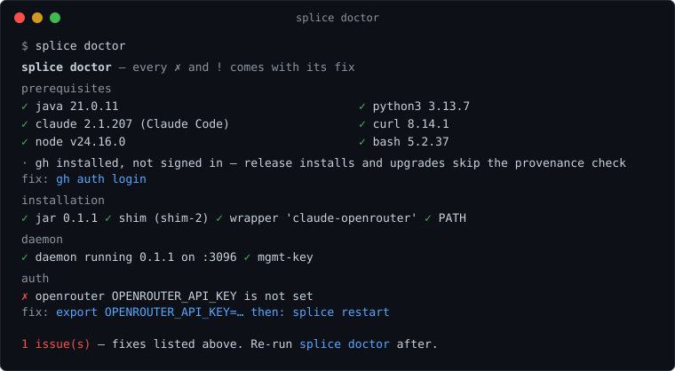
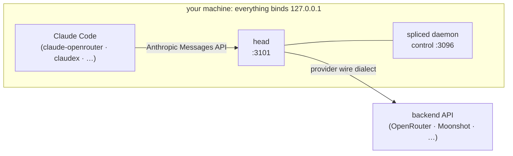

<div align="center">

# splice

**Use [Claude Code](https://docs.anthropic.com/en/docs/claude-code) with the models and subscriptions you already use.**

ChatGPT · Grok · Kimi · Muse · API backends · Claude

[Why splice](#why-it-exists) · [Install](#install) · [Quick start](#quick-start) · [Providers](#provider-support) · [Trade-offs](#why-you-might-not-want-splice) · [Changelog](CHANGELOG.md) · [Security](.github/SECURITY.md)

[](https://github.com/torad-labs/splice/actions/workflows/ci.yml)
[](https://github.com/torad-labs/splice/releases/latest)
[](https://github.com/torad-labs/splice/attestations)
[](LICENSE)

</div>

```text
splice puts Claude Code in front of the backend you choose.

  Requests are translated for your chosen backend.
  Interrupted compactions can resume from their saved answer.
  Retries stop at a set limit, and keys and sign-ins are never saved half-written.
  Your tools, permissions and shared Claude Code configuration stay yours.
  You see usage and what priced turns would cost at API rates.
  Doctor gives a remedy for failing checks.
  Sessions on different heads can discover and message each other.
```

Type `claudex` instead of `claude` to work with a ChatGPT-backed model inside Claude Code. Use `claude-grok`, `claude-kimi` or `claude-muse` for those subscriptions, or connect an API backend such as OpenRouter. You keep Claude Code itself: its tools, permission checks and terminal, your hooks, skills, agents, commands, CLAUDE.md and permissions, and a session's history when you resume it on another head (`claude-grok -r`). Each head can have its own system prompt, and each provider its own tool handling; splice connects it all to the backend you choose.

The gateway runs locally on your machine. Model requests go to the chosen provider, including a local runtime when you configure one. Subscription connections run on the plan you already pay for; API-key connections use ordinary pay-per-token access.

Signing in happens on each company's own page: `claudex login`, `claude-grok login`, `claude-kimi login` and `claude-muse login` open the sign-in page of OpenAI, xAI, Kimi or Meta. Claude uses Claude Code's own `/login`. Credentials stay on your machine: OAuth logins in `~/.config/splice/auth/`, API keys in `~/.config/splice/keys.toml`, and plain claude’s login and claude-splice’s own login in their separate Claude Code directories. Additional Claude accounts have separate folders under `~/.splice/state/claude-accounts/<head>/`; saved copies of the commands' own logins live under `~/.splice/state/claude-logins/`. Your requests go from your machine to that provider, and splice also connects to a webhook URL if you save one for budget alerts, and to GitHub: to download a release when you install or upgrade, and to fetch rig's installer if you choose a local model in `splice setup` (rig then downloads the model itself). [Credential locations](#credential-locations) and [What splice keeps on your disk](#what-splice-keeps-on-your-disk) have the details.

## Why it exists

Choosing a different model shouldn't mean rebuilding your coding workflow around a different client. splice lets you keep Claude Code while working across backends and makes those sessions useful together.

- **Use the subscriptions you already pay for.** Connect ChatGPT, Grok, Kimi or Muse through dedicated commands, or choose a pay-per-token API route. [Provider support](#provider-support) spells out the differences.
- **Let different models work together.** A ChatGPT-backed session can find and message a Grok-backed session using Claude Code's own agent tools. [Shared session discovery](#heads-that-see-each-other) is enabled by default, with isolation available when you need it.
- **Spend less time recovering long sessions.** More reliable compaction means fewer interruptions and less repeated work. If the client disconnects, an identical compaction retry can pick up the work already underway. [How recovery works](#long-session-reliability).
- **See usage without leaving the session.** Provider-reported plan usage appears in Claude Code's status line. [`splice status`](#manage-your-sessions) prints each head's connection state.
- **Get a fix, not just an error.** [`splice doctor`](#troubleshooting) checks the installation, configuration and authentication, and prints the remedy for each failing check. Release installs verify checksums before going live, and build provenance whenever the GitHub CLI is signed in.

### A workflow across models

After configuring and signing in to the matching providers, open each command in a separate terminal:

```bash
claudex       # Claude Code using your ChatGPT subscription
claude-grok   # Claude Code using your Grok subscription
```

For example, ask one session to implement a change and the other to review it. They can discover each other with `ListAgents` and exchange findings with `SendMessage`; you don't have to copy messages between terminals. Each session still uses Claude Code's own tools and permissions.

Each named backend connection is called a **head**. You choose which heads to configure and launch; the commands above do not configure providers for you.

**In [v0.4.0](https://github.com/torad-labs/splice/releases/tag/v0.4.0):** a launched session holds a turn key, never the management key; `splice upgrade` with rollback; per-head account pools with automatic switching on ChatGPT, Grok, Kimi, Muse and Claude; first-class local models; and [code mode](#code-mode-for-chatgpt) on by default for ChatGPT. Coming from 0.3.x? Read [the upgrade notes](CHANGELOG.md#upgrading-from-03x) first.

## Install

The release installer checks your prerequisites, verifies the downloaded jar and launch shim against the release's checksums, and finishes with `splice doctor`. No GitHub account is needed.

### Requirements

**Platforms:** Linux and macOS natively; **Windows via WSL2** (run `wsl --install` in PowerShell
once, then do everything below inside the WSL shell; it behaves exactly like Linux). Native
Windows shells are refused by the installer with the same guidance: the launch shim and daemon
are Unix programs.

On macOS, splice identifies sessions from launcher-written process records; sessions launched outside splice remain unknown.
Hosted MCP servers have no memory cap or OOM protection on macOS.
The per-turn write bound still runs on macOS, without the kernel acknowledgement count.

| Dependency | Why | If missing |
| --- | --- | --- |
| **Java 21+** | the spliced daemon ships as a fat jar | `apt install openjdk-21-jre-headless` · `brew install --cask temurin@21` · [adoptium.net](https://adoptium.net) |
| **Node 22.15+**, with 24 recommended | the launch shim needs `process.execve` | [nodejs.org](https://nodejs.org) or `nvm install 24` |
| **Claude Code** | splice wraps it; `claude` must resolve on PATH | `npm install -g @anthropic-ai/claude-code` |
| **curl** + **bash** | the installer | preinstalled almost everywhere |
| **GitHub CLI** (optional) | signed in, it lets release installs and `splice upgrade` also verify each asset's build-provenance attestation | [cli.github.com](https://cli.github.com), then `gh auth login`; without it the install still verifies checksums and prints the command that checks provenance later |

You don't have to pre-check any of this: `install.sh` verifies every dependency up front, prints
the exact fix for your machine's package manager. When you run `./install.sh` with both input
and output attached to a terminal, it also offers to run each fix, with consent. `splice doctor` re-verifies everything at any time.

### Install a release

```bash
curl -fsSL https://github.com/torad-labs/splice/releases/latest/download/install.sh | bash
```

The downloaded jar and launch shim are checked against the release's `sha256sums.txt`. If the GitHub CLI is installed
and signed in, the installer also verifies each asset's build-provenance attestation; if not, it
prints the `gh attestation verify` command that does it later.

To pin one version instead of following `latest` (prereleases never become `latest`):

```bash
curl -fsSL https://github.com/torad-labs/splice/releases/download/v0.4.0/install.sh \
  | env SPLICE_VERSION=v0.4.0 bash
```

**Upgrading.** `splice upgrade` fetches and verifies the latest release the same way (or one
version with `--to vX.Y.Z`), stages it beside the current one under
`~/.local/share/splice/releases/`, waits up to 30 minutes for every head's in-flight turns to finish (`--now` skips
the wait), repoints the live jar, restarts the daemon and runs doctor. If the wait expires, the
release stays staged. The live launch shim is replaced to match the jar. An edit to a recorded
release's shim is saved as `splice-launch.edited` beside that release, with its diff printed;
a flat install's live launcher is kept as `splice-launch.edited`, because splice cannot tell whether it was edited. It is also recorded as the rollback copy. `splice upgrade --rollback` puts the previous release back; it is kept
until the next successful upgrade. Config and credentials are never touched. 0.3.x has no
`splice upgrade`: re-run the pinned installer above, then follow
[the 0.4.0 upgrade notes](CHANGELOG.md#upgrading-from-03x).

<details>
<summary>Other installation options: from source or with a coding agent</summary>

**From source:**

```bash
git clone https://github.com/torad-labs/splice.git
cd splice
./install.sh
```

**Let your agent do it.** Give this prompt to any coding agent with shell access:

```text
Install splice (https://github.com/torad-labs/splice) on this machine and verify it works:
1. Check prerequisites: bash, curl, Java 21+, Node 22.15+ (24 recommended), and Claude Code
   (`claude` on PATH). Install anything missing with this machine's package manager:
   show me each install command and ask before running it.
2. Install from source: `git clone https://github.com/torad-labs/splice && cd splice
   && ./install.sh` (or use the release one-liner from the README instead).
3. Make sure ~/.local/bin is on my PATH (add it to my shell rc if not).
4. Ask me for an OpenRouter API key (I can create one at https://openrouter.ai/keys),
   store it with `splice key set OPENROUTER_API_KEY --stdin`, without printing it, then run
   `splice add openrouter --yes`. The key store also works with a systemd-managed daemon.
5. Run `splice doctor` and fix anything it flags. Every failing check prints its own
   fix command. Repeat until it reports no blockers.
6. Tell me it's ready and that `claude-openrouter` launches Claude Code through OpenRouter.
```

The agent can drive that loop for the same reason you can: `splice doctor` prints the fix for
every failing check.

</details>

## Quick start

### API-key starter: OpenRouter

This is the zero-config provider path. It uses a paid API key, not a subscription allowance.

```bash
export OPENROUTER_API_KEY="…"     # vendor-issued pay-per-token API key
splice add openrouter             # sign in, add the head and install its command
claude-openrouter                 # launch it; splice status shows its loopback port
```

`splice add openrouter` offers every text-producing, tool-capable model OpenRouter serves, refreshed hourly. It writes `model_slots` to keep the opus, sonnet, haiku and fable tier mappings without restricting the picker. Each model keeps its own window and price. A `[[providers.openrouter.models]]` row is optional when you want your own label, window or rates.

`models` remains an explicit serving allowlist. Existing heads keep theirs until you edit it. To keep a discovered roster while choosing tiers, use `model_slots` under the existing head's table instead of a slotted `models` list:

```toml
[heads.example]
provider = "example"
port = 3105
discovery_prefix = "claude-example--"
pinned_model = "vendor/model-a"
model_slots = { opus = "vendor/model-a", sonnet = "vendor/model-b" }
```

Use your existing head key and fields in place of the example. Slot names are opus, sonnet, haiku and fable, with one model per slot and one slot per model. Do not combine `model_slots` with slots inside `models`. An unslotted `models` allowlist can have a separate tier map, but its tier ids must be allowed. A mapped model the endpoint does not list stays unmapped, with a boot-log explanation, rather than selecting another model. Restart after changing tier mappings.

A model you add this way is priced from the card OpenRouter lists for it, read when the daemon starts and every hour after, so its turns read `API est.` on the status line and count against a budget. A model OpenRouter lists no price for reads `no rate card`. A `rates = { input = …, cache_read = …, output = … }` line on the row wins over the listed price.

No export handy? There are two other ways to get the key in. Both land in
`~/.config/splice/keys.toml` (0600), which every later daemon start reads from any shell:

- `claude-openrouter login`: a masked terminal prompt (the key never hits shell history, `ps`, or a
  session transcript).
- Inside a `claude-openrouter` session, while the key is missing, splice offers to capture it: paste the
  key as a **bare message** (nothing else in the text) and it is stored and blocked before it
  reaches the model. It never travels upstream. The session transcript still records the paste,
  so the masked `claude-openrouter login` stays the zero-trace path.

An explicit `OPENROUTER_API_KEY` in the daemon's environment always wins over the store.
`splice key set|list|unset` manages the store directly (`--stdin` for scripts).

### Subscription setup: ChatGPT, Grok, Kimi or Muse

Run `splice add codex`, `splice add grok`, `splice add kimi` or `splice add muse`. It adds the provider and head, chooses a free port, signs you in, links the command and offers to restart the daemon. Then launch `claudex`, `claude-grok`, `claude-kimi` or `claude-muse`.

If the daemon is already running, finish pending work before a full `splice restart` to load topology changes; a `context_window` edit needs none (see [Long-session reliability](#long-session-reliability)). A head restart alone does not reload TOML. splice keeps its own credentials; you don't need to share the vendor CLI's credential file. See [credential locations](#credential-locations).

### Claude

`claude-splice` routes Claude Code through splice and keeps its own Claude Code config directory. Sign in with `/login` inside that command. Plain claude’s login and claude-splice’s own login are separate. A Claude head can also hold additional subscriptions in separate splice-owned folders and select between its available logins per request ([More than one Claude login](#more-than-one-claude-login-on-claude-splice)). Splice reads the commands' live access tokens for selection but never refreshes their credentials. It refreshes only the added accounts whose folders it alone owns.

### The billing word in Claude Code's header

Claude Code's header prints a billing word beside the model. On `claude-splice` signed in with a Claude subscription, it names that plan, for example `Claude Max`. On every other head it reads `API Usage Billing`: Claude Code only has names for Anthropic's plans and the clouds that sell Claude, so it prints that for any other service. It does not mean Anthropic is billing you. Each head uses the plan, key or GPU you set it up with, and splice's status line shows an estimate at API rates, labelled `API est.`, where splice has a rate card for the model.

## Manage your sessions

Admin verbs go through the `splice` command:

```bash
splice status         # per-head status
splice doctor         # check the whole install; every failing check prints its fix
splice doctor --json  # the same as a redacted, shareable report (--with-logs, --out FILE, --live)
splice add <profile>  # add a provider + head without editing TOML (codex|grok|kimi|muse|deepseek|openrouter|claude|local|api-key)
splice add-model      # put more of the curated OpenRouter models on an OpenRouter head
splice models         # what each provider ACTUALLY serves, against your declared rows (--all, or one provider)
splice upgrade        # verified upgrade to the latest release (--to vX, --now, --rollback)
splice sessions       # the Claude Code sessions on this machine, joined to their heads
splice perf           # per-head latency, failure and cache summary (--window 1h|24h|7d)
splice wire <head>    # the request bodies a head sent upstream; only once you opt that head in
splice trace <head>   # a head's full request/response trace from disk (--turn ID, --purge); on for every head
splice restart        # restart; a supervising systemd unit supplies its own environment
splice init           # write a starter config with no head; install.sh already runs it
splice install --all  # (re)link the wrapper commands
<head> login          # sign in a subscription head (claudex, claude-grok, claude-kimi, claude-muse)
```

`splice add` asks only for what a profile cannot know (a base URL and models for a generic
OpenAI-compatible endpoint), signs in through the same flow as `login`, checks the candidate
before writing anything: the file parses, the credential is present, the endpoint answers, and
models and published window sizes agree where available. It appends the tables through a temp
file and one rename, links the command and handles the restart. `--live`, or yes at the optional
prompt, checks the saved head through its installed command. A failed check diagnoses the
failure and leaves the head saved. A refusal before the save leaves your file byte-identical.

The control plane's data and control API need a secret key and answer only on this machine. `/health` reports the version without a key. Sessions get a weaker turn key shared across the install, which opens every head's turn, status-line and resume-hook routes, but not management routes. The key lives at `~/.splice/state/mgmt-key` (installs made before v0.4.0 keep theirs at `~/.claude-codex/state/mgmt-key`, which splice keeps reading in place).

### Plan usage in Claude Code

splice passes provider-reported usage into Claude Code's status line, including usage windows and reset times where available. On Claude heads, the usage reading comes from the carrying login's quota, then from the next selectable login if no carrying reading is available.

The status line marks usage with `⚠` once it reaches the `usageWarnPct` setting. The warning is advisory; it does not block requests.

Subscription heads poll their own provider every five minutes while the daemon is running so usage can appear before the first turn. ChatGPT reads its usage endpoint, Kimi its usages endpoint, Grok its billing endpoint, and Muse the usage in its key-mint response, using that head's own credential. Heads using an API key, and heads passing Claude Code's own login through, do not poll. Set `CLAUDEX_QUOTA_POLL=off` in the daemon's environment to disable polling, then restart the daemon after pending work finishes; usage can still arrive in each turn's rate-limit headers.

## Heads that see each other

Ask a session on one backend to get a review from a session on another. Both appear in Claude Code's `ListAgents`, and `SendMessage` carries the request and reply. This works across splice heads and plain `claude` sessions on the same machine.

Underneath, Claude Code discovers peers through a `sessions` directory. Without sharing that directory, each head's separate config would hide the other heads' sessions.

On the first launch of each head, splice links its `sessions` directory to the shared registry under `~/.claude/sessions`, creating that registry if plain `claude` has never run. That shared registry is what makes cross-head discovery possible.

There is nothing to configure. `sessions` is in the default `[claude].share` list. Put it in a head's `isolate` list to wall that head off, or remove it from `share` to turn the feature off everywhere. Release tests check this on a clean install.

A team is created with `PUT /api/teams` on the control plane. Give it a repo, a goal and role slots, each with a role, a head, its own instructions and a session. On its next turn through splice, a session bound to an active team gets its role, the team goal, the slot's instructions and where to reach the lead. The teams API reports each seat's role, plan, session, instructions and whether it is working, with lifetime turns and estimated cost at API rates, plus hand-offs and sampled activity. The economics API aggregates turns, tokens and estimated dollars at API rates per role and slot. A plain `claude` session can hold a slot, but its own messages don't pass through splice, so the teams API shows only what it receives.

## Troubleshooting

`splice doctor` checks prerequisites, install integrity, config, daemon, and auth, then prints
the exact fix under every failing check. `splice doctor --json` writes the same findings as a
report you can share: versions, the topology's shape (never a credential, an account id or a
working directory), every check with its fix, and the last perf rows; `--with-logs` appends the
last 500 daemon lines through the same redaction, `--out FILE` writes it. Nothing is uploaded.

`splice sessions` lists the Claude Code sessions on the machine with the head that launched each
one and whether it is live, stale or gone, plus the `SendMessage` line that reaches it.
`splice perf --window 24h` shows, per head, how long turns wait before the first byte and how long
they stream, the failure share by outcome, retries, cache hit ratio and peak concurrency.

When a session's Claude Code is newer than the version this splice release was tested with,
doctor, `splice status` and the status line say so once; equal or older is silent.



The daemon reads API-key env vars from **its own** environment. Export a key *after* the daemon
has started and the shell sees it but the daemon does not: launches warn, requests fail upstream. `splice restart` uses your current
shell's environment unless a systemd user unit runs the daemon, when the unit's environment applies; `splice doctor` detects this state explicitly. Keys in
`~/.config/splice/keys.toml` sidestep the whole class: the store is re-read per request, so a
`claude-openrouter login` or `splice key set` lands on the next request, no restart required.

## Credential locations

Each of these is a **password-equivalent secret**: anything that can read the file (or the environment variable) can spend against your account. Keep files `600`, never commit them, never paste them.

Splice signs in on its own. Each OAuth head keeps its own credential file under `~/.config/splice/auth/`, written by `splice login <head>`, and it may be a different account from the one the vendor's own CLI or desktop app uses. The native apps' files (`~/.codex/auth.json`, `~/.grok/auth.json`, `~/.kimi/credentials/kimi-code.json`, `~/.config/muse/auth.json`) are never read unless you name one in `auth.file`. Sharing a file lets both programs rewrite the same credential, so a refresh or replacement can leave the other program using stale bytes. `splice doctor` warns when a head still names one.

| Backend / route | Auth kind | Location | Notes |
| --- | --- | --- | --- |
| Claude (`claude-splice`) | `client` | Plain claude’s login and claude-splice’s own login in separate Claude Code directories; additional accounts under `~/.splice/state/claude-accounts/<head>/<label>/` | Claude Code performs sign-in; splice never refreshes the commands' own credentials and refreshes only the added folders it owns |
| codex (ChatGPT) | `chatgpt-oauth` | `~/.config/splice/auth/codex.json` | splice's own OAuth tokens (`splice login claudex`); `~/.codex/auth.json` only by explicit `auth.file` |
| grok (xAI) | `grok-oauth` | `~/.config/splice/auth/grok.json` | splice's own OAuth tokens (`claude-grok login`); `~/.grok/auth.json` only by explicit `auth.file` |
| kimi (Moonshot) | `kimi-oauth` | `~/.config/splice/auth/kimi.json` (+ `device_id` beside it) | splice's own device-flow token (`claude-kimi login`); the app's file only by explicit `auth.file` |
| muse (Meta) | `muse-oauth` | `~/.config/splice/auth/muse.json` | splice's own device-flow account token plus minted inference key (`claude-muse login`); the Muse Code CLI file only by explicit `auth.file` |
| OpenRouter | `api-key` | `$OPENROUTER_API_KEY` (env) or `~/.config/splice/keys.toml` | API key; password-equivalent |
| Moonshot (pay-per-token) | `api-key` | `$MOONSHOT_API_KEY` (env) or `~/.config/splice/keys.toml` | API key; password-equivalent |
| splice api-key store | - | `~/.config/splice/keys.toml` (0600) | env wins over the store; password-equivalent |
| splice control plane | - | `~/.splice/state/mgmt-key` (pre-0.4 installs: `~/.claude-codex/state/mgmt-key`) | control API key; password-equivalent |

### More than one ChatGPT, Grok, Kimi or Muse account

An OAuth head (ChatGPT, Grok, Kimi or Muse) can hold several accounts of its kind and switch between them when one runs out. Claude heads also have per-head pools, with different credential ownership and sign-in ([More than one Claude login](#more-than-one-claude-login-on-claude-splice)).
`splice login <head>` without `--label` always signs in the primary account in the file above,
so a revoked primary is replaced in place; every further `splice login <head> --label <name>` lands
beside it under `<primary directory>/<kind>/<primary file>/<name>.json`, for the default primary
`~/.config/splice/auth/chatgpt-oauth/codex.json/<name>.json` (its quota state in `<name>-quota.json`
next to it). A custom `auth.file` moves the pool beside that primary credential. `--label auto` derives the name from nothing personal: the ChatGPT plan plus a short
hash of the account id, or `grok-2`, `kimi-3` by ordinal. A file is only ever used by the provider
whose kind it carries inside; a mislabeled file is refused at boot, never silently used. A head
holding one account has no pool and behaves exactly as before: nothing extra on the status line,
in `splice status` or in `splice doctor`. Inside a head, `/login` signs in the primary and
`/login --label <name>` adds an account the same way; a `/login` while an earlier sign-in is still
waiting for its browser cancels one started by the hook and starts over on Linux. A terminal-started login is named and left alone.

A pool does not lift a plan's limits: it lets a session continue on another account you hold while
one is exhausted.

Selection is sticky per session and decided only between turns. A manual pin goes first. A saved
order then gives explicit priority; without one, a session keeps its usable account and fallback
prefers an available account whose weekly quota resets soonest, with the five-hour reset breaking
ties. Missing or expired quota does not outrank a usable current reading. The session changes
accounts when its quota is exhausted, its credential is rejected or a provider hold makes it
unavailable; it does not return to the primary just because that account's window reset. A turn already streaming finishes on the account it
started on. The first turn after a switch pays one cold prompt-cache read, and its perf row says
so and names the account. When every account is out, the turn fails the way limits fail today
and names the earliest reset across the pool. The status line names the session's account and why it switched. `splice status` and `splice doctor`
show the head's accounts and its last automatic switch; the daemon log
records each switch once under `[<head>]`.

### Sign in to a ChatGPT account from the console or the terminal

In the console's Accounts page, a ChatGPT head's sign-in uses the device code. The daemon starts the
flow and the page shows a verification address and a code. Open the address on any machine, enter
the code, and the page finishes when you approve. The code lives 15 minutes. A refused or expired code
says so on the page; try again. Pick a label when you sign in, or leave it to default to the plan
name plus a short hash of the account id. "Sign in again" on a head's first account replaces it in
place under its own label. The email and account id are never displayed whole: the account
is described by a masked user id and a masked email.

In a terminal, `splice login codex [--label <name>]` opens the browser flow, as before. Kimi and
Muse use the device code in both places.

### Pin a head or a session to an account

Selection is automatic (see above), and you can override it. On the Accounts page, "Use now"
pins the head to that account and the pin button on it releases the pin. The same two calls are on
the control API, with the management key as the bearer:

```sh
curl -X POST   -H "Authorization: Bearer $KEY" -d '{"label":"work"}' \
     http://127.0.0.1:<control port>/api/auth/codex/switch                    # the whole head
curl -X POST   -H "Authorization: Bearer $KEY" -d '{"label":"work","session":"<session id>"}' \
     http://127.0.0.1:<control port>/api/auth/codex/switch                    # one session only
curl -X DELETE -H "Authorization: Bearer $KEY" \
     "http://127.0.0.1:<control port>/api/auth/codex/switch?session=<session id>"
```

A session's pin outranks the head's pin for that session only. `DELETE` without `session` drops the
head's pin and always answers `{"ok":true}`. A label the head does not hold, or an account with no
credential file, is refused and nothing is pinned. A pin on an account that is out of quota falls
back to the automatic rule and stays set. The pin takes effect on the next turn, and a daemon
restart clears every pin. Without any pin, a session keeps its account until a limit, then moves to
the account whose weekly window resets soonest.

### API keys on the Accounts page

An API-key head's key appears as an account: its variable name (for example `DEEPSEEK_API_KEY`), a short
fingerprint, the day splice first saw it, and the keys it replaced, each with its own first-seen day.
Rotating a key reads as a new account and the old one stays listed as replaced. The key itself is
never shown or logged; `splice key set|list|unset` or `PUT`/`DELETE /api/keys/<VARIABLE>` manage
the store. If the ledger (`key-ledger.json`) cannot be written, the list still answers, a key first
seen at that moment shows no day, and the daemon log says so once.

### Reading the configuration answer

`GET /api/config` (add `?head=<key>` to fold in that head's overrides) answers one entry per knob in
`knobs`: its `value`, the `scope` that set it (default, toml, head, file, env or runtime), its
`disposition` (`live` takes effect on running sessions, `restart` needs a daemon restart), and
`editable`. A knob that cannot be changed carries a `read_only_reason`. A head-only knob is set in
`[heads.<key>.overrides]`, never by `PATCH`. `mirrorReasoning` is pinned false: it reads `restart`, is
not editable, and any value written for it, in TOML or by `CLAUDEX_MIRROR_REASONING`, is dropped.

### A second head on the same provider

`splice add <profile> --name <key>` adds another provider-and-head pair for a profile you already
use, for example a second ChatGPT or OpenRouter head with its own models. The key takes lowercase
letters, digits and dashes and must be new. splice picks a free port, names the command
`claude-<key>` unless you pass `--command`, and an API-key head reads its own `<KEY>_API_KEY`.
`--model <id>` adds rows. A key, a command or a table that already exists is refused with a
sentence naming it, and a duplicated TOML table is reported by name and line, never by value.

### Test homes and loopback-only endpoint overrides

The sign-in and usage endpoints can be pointed at a stand-in for tests: `CODEX_OAUTH_ISSUER`,
`CODEX_OAUTH_TOKEN_URL`, `CODEX_OAUTH_AUTHORIZE_URL`, `GROK_OAUTH_ISSUER`, `GROK_OAUTH_AUTHORIZE_URL`,
`GROK_OAUTH_TOKEN_URL`, `KIMI_OAUTH_HOST` and `CLAUDE_OAUTH_USAGE_URL`. Those endpoints receive your
token, so splice accepts an override only when its host is `localhost`, `127.0.0.1` or `::1`.
Any other host is ignored, the vendor's address is used, and the daemon log names the variable
once. The rule is on the host, not on which home the daemon runs in, so a test home answers from a
stand-in on its own machine.

### More than one Claude login on `claude-splice`

A Claude head can hold multiple subscriptions. `POST /api/auth/<head>/login` on the control plane
adds one through Claude Code's own browser sign-in into a new folder under `~/.splice/state/claude-accounts/<head>/<label>/`, never
replacing another login. Once filed, it can join a running head through membership publication.
The pool is per head, uses the same pin, saved order and sticky default selection described above,
and switches only between turns. Plain claude’s login and claude-splice’s own login are separate
selectable places on `claude-splice`: splice reads their live access tokens without refreshing
or replacing their credentials during selection. It can refresh an added folder's credential
because no other program uses that folder.

Removing or renaming
a Claude login requires its explicit target kind and stable id; a saved display name never
chooses between a command's own login and an added account with the same name. Removing a
command's own login is refused while its sessions are active or their state is unknown, and its
credential is backed up before removal.

The labelled-copy CLI is separate from automatic pool selection. `claude-splice` still holds one
own login at a time in its config directory; `splice login claude-splice --label <name>` saves or
switches copies of that login:

- **Save.** With a login the label has never seen, it saves the head's live login under `<name>`
  and selects it. With the label the head already holds, it saves the newer copy over the old.
- **Switch.** With another saved label, it first saves the head's live login under its own label,
  then puts `<name>`'s copy in the head. The next session of `claude-splice` signs in with it.
- **Add an account.** With a new label while the head's login is already saved under another, it
  saves that one and signs the head out. Start `claude-splice`, `/login` with the new account,
  exit, and run the same command again.

A saved login can become stale after the head refreshes it. A launch never copies a saved login
into the head, and `splice login` changes the head's login only under four rules:

1. **Save before switching.** The login being replaced is saved under its own label first, so
   every saved copy is its account's newest. If that save fails, nothing is switched.
2. **Never under a running session.** While any session of `claude-splice` runs, or while splice
   cannot tell, it changes nothing and names the session.
3. **Filed by account.** Each label records its account's id and email from the head's
   `.claude.json`, never a token; this labelled-copy operation copies the credential file byte for byte and never calls Anthropic with it. A login
   is filed only under the label of its own account. A `/login` to another account inside the head
   is refused under the selected label, naming both accounts: save it under a new label, or add
   `--discard` to a switch to drop it.
4. **Fail closed.** If splice cannot read whose login the head holds, it changes nothing.

A saved copy that may be older than its account's last refresh is never put back. That covers a
label whose login left the head without being saved first (a `/login` to another account, or a
`/logout`), and a copy saved before splice recorded accounts. Re-save it from a live login: sign in
to that account with `/login` in `claude-splice`, then run `splice login claude-splice --label
<name>`.

## What splice keeps on your disk

splice does not upload these files. Their intended uses can send bytes to the configured
provider: credentials authenticate requests, and cached reasoning goes back with a tool round-trip.
New installs keep state in `~/.splice/state` and logs in `~/.splice/logs`. A pre-0.4 install can
keep `~/.claude-codex/state` and its logs; `[daemon] state_dir` or `SPLICE_STATE_DIR` can select
another state directory. State and log directories are owner-only (0700) at daemon start, but a
custom state directory's parent is not made owner-only.
Topology, API keys and subscription sign-ins normally live in `~/.config/splice`. The management
key, runtime settings, config backups and saved Claude logins live in the state directory.
Every credential splice writes is 0600. splice also writes into the Claude Code config directories it launches
(`~/.claude-<head>/`), and the install lives in `~/.local/share/splice` and `~/.local/bin`.

"Only you" below means owner-only: the file is 0600, or it sits inside an owner-only state or log directory.
The tables use new-install defaults; a selected state root changes those paths.
"Your umask" means the file gets your account's default permissions, usually readable by other
local accounts unless its directory prevents it. The last column names the source file that writes
it; a check in the build (`DiskWritesLawTest`) fails when any source file writes a file this section
does not name, and when a file it names gains a write the check has not recorded, so each new write is
read against its row. It reads Kotlin sources, so it misses a write through a library handed a path,
a shell redirect to an unquoted or literal path, reflection, and files written by programs splice starts.

### Content from your sessions, kept with nothing turned on

| File | What it holds | Who can read it | How long it stays | Written by |
| --- | --- | --- | --- | --- |
| `~/.splice/state/activity/activity-<day>.jsonl`, `.jsonl.lock` and `.jsonl.1` | Activity labels: the file a session read, the program it ran or the pattern it searched, 32 characters of each, about one every 30 seconds while it works; `activityStoreHeads = ""` stops new labels after restart | Only you | Today and yesterday (UTC), so the activity API can return your whole local day: a day's file is deleted at the second UTC midnight after it (within 10 minutes of waking, if the computer slept through it), or at the next daemon start if splice was stopped. `DELETE /api/kept/labels` deletes retained rows now | `ActivityStores.kt` |
| `~/.splice/state/heads/<head>/code-mode/<hash>.jsonl` and its empty `.lock` | A Codex head's code mode, one journal per session, conversation and model key (named by its hash): the model's scripts, tool calls with their arguments and results, script output and reasoning summaries | Only you (0600 journal, in a 0700 directory) | A conversation expires 24 hours after its last use, checked every 5 minutes. Capacity pressure can reclaim parked cells, including a live session's, but never executing or borrowed cells. The idle sweep reclaims unknown sessions after 30 minutes and known-dead sessions, never a known-alive cell merely for being quiet. The default stored-byte budget is a quarter of the daemon's maximum heap, and known-live sessions are protected from budget eviction. There are no default record-count, call-count or round-count caps. Explicit count overrides still apply, with known-dead sessions reclaimed first. Expiry markers age out one configured record lifetime after expiry. Each save appends changed top-level conversation fields and changed cell snapshots. Retention deletions compact the file to remove expired payload bytes. Checkpoints force the replacement file before the atomic rename, then force its directory. A legacy `<hash>.json` is removed only after its `.jsonl` replacement is durable. Across downgrade, the latest cell and expiry state wins; `.jsonl` wins identical-state ties. The whole directory goes at the next daemon start once code mode is off for the head or the head leaves `splice.toml`. The older single head file is migrated on first load. | `CodeModeStateJournal.kt` |
| `~/.splice/state/trace/<head>-<day>.jsonl`, `.jsonl.lock`, `.jsonl.1`, `.jsonl.bodies2` and, for days before 2026-10-05, `.jsonl.bodies` | Every head records requests with sign-in headers removed, upstream bodies and responses, and client frames by default. JSONL rows hold stamps and content-addressed body references. Daily binary packs store deterministic chunks of about 8 KiB, each compressed with zstd, sharing identical client/upstream bodies and unchanged prefixes within one rolling 32 GiB body budget across every head. The current UTC day is protected; pressure evicts the oldest complete day's body packs across heads without removing its JSONL records. A 64 GiB usable-space floor on the trace volume takes priority over the budget. Refused new bodies keep an explicit unavailable marker with the reason, and stored bodies remain reusable; a head logs the refusal once per day in `daemon.log`. `splice trace` hydrates selected records and still reads legacy inline rows. Each body is kept whole up to `traceMaxBodyChars` (default 16 Mi characters), with longer bodies marked truncated. Trace telemetry uses page-cache writes without per-record forces. A head with `[heads.<key>.overrides] trace = "false"`, or capture switched off with `PUT /api/heads/<head>/capture`, stops new writes after restart. | Only you (owner-only directory) | `traceRetentionDays` (default 7): whole UTC days and their packs age out at midnight or the next daemon start; `splice trace <head> --purge` or `DELETE /api/heads/<head>/trace/kept` deletes retained days and packs now. Companion-only days remain discoverable, including removed heads and heads switched off, whose days are removed on the next start. | `HeadTraceStores.kt`, `TraceBodyPack.kt` |
| `~/.splice/state/trace/<head>-<day>.jsonl.bodies-evicted` and its temporary `.tmp` sibling | The fixed reason `evicted by the body budget`, so retained records whose body packs were evicted read as explicitly unavailable. The owner-only temporary marker is forced, atomically published and its parent forced before any pack is removed | Only you (0600 marker, owner-only directory) | Ages out or is purged with its trace day. The temporary sibling is removed after publication or a failed write | `DayBodyBudget.kt` |
| `~/.splice/state/compactions/<head>/<hash>.json` | The answer of a finished compaction whose client hung up, kept so its retry gets the same bytes | Only you (0600) | Until the retry takes it, 2 hours at most: an expired one goes at the head's next save or the next daemon start, and a head removed from `splice.toml` loses the whole directory at the next start | `CompactionRecordings.kt` |
| `~/.splice/state/heads/<head>/reasoning/<conversation>.jsonl` (and an empty `.lock` beside each) | The provider's encrypted reasoning for each tool call plus its readable summary, on ChatGPT, OpenAI Responses and Muse heads by default. The summary is not encrypted: anyone who can read the file can read it. A restarted daemon can send the envelope back to that provider | Only you (0600, in a 0700 directory) | No inactivity expiry; survives restart. Removed when the conversation compacts, when the provider rejects it as stale, or when the head holds more than 8192 rounds or 64 MB across its conversations (the least recently used conversation goes first). Its conversations go at the next daemon start once the head's `reasoning_cache` is off, and the whole directory once the head leaves `splice.toml` | `ReasoningCacheFiles.kt` |
| `~/.splice/logs/daemon.log` (and `daemon.log.1`) | The daemon's log. Most lines are about the daemon itself, but some quote short pieces of content: an upstream error body (up to 200 characters), a provider's failure message, a stream frame splice could not read, and the activity labels | Only you | Rotated at 64 MB, one older copy kept | `DaemonBoundary.kt` |
| `~/.splice/logs/daemon-boot.log` (and `.1`) | The JVM's own output when splice starts the daemon itself (`splice restart` or a launch's cold start): lines from before the logger exists, a boot crash's message and stack, JVM warnings, and any line `daemon.log` could not take. An unsupervised restart through `POST /api/daemon/restart` also writes its detached CLI result here. Under `splice.service` it is not written; that output goes to the systemd journal | Only you | Rolled at the next start once past 1 MB, one older copy kept | `DaemonLaunch.kt`, `DaemonSuccessor.kt`, `splice-launch` |
| Claude Code's transcripts (`projects/…/<session>.jsonl`) | No new text. When a session resumes on a head that serves other models, splice rewrites assistant rows whose model the head does not serve, including subagent transcripts. It preserves the entire session's original JSONL files before changing any file. A failed original copy leaves every transcript unchanged. Their thinking is removed; only a row left empty gets `[Thinking removed]`, in one atomic replace that keeps the file's permissions | Whoever could read it before | They are Claude Code's files; splice changes them in place after preserving originals | `TranscriptModelRewrite.kt` |
| `~/.splice/state/transcript-originals/<project>/<session>.jsonl`, `<session>/…/*.jsonl`, `<session>.sources.json` and the store's empty `.lock` | Byte-exact main and nested transcript originals before the first cross-head rewrite, plus their local live transcript locations. Existing originals are never replaced. New nested files are preserved before a later rewrite. This is outside Claude Code's projects tree, so originals do not appear in its resume lists | Only you (0600 files in 0700 directories) | Until every recorded live transcript location is positively gone, checked at daemon start. An unreadable location keeps its original | `TranscriptOriginals.kt`, `TranscriptOriginalCopy.kt` |

To stop trace capture, use your existing head's key in place of `example`, then restart:

```toml
[heads.example.overrides]
trace = "false"
```

### Content kept only when you turn it on

| File | What it holds | Who can read it | How long it stays | Written by |
| --- | --- | --- | --- | --- |
| A copy of another head's transcript in `~/.claude-<head>/projects/` | With `isolate = ["projects"]` on a head: resuming a session another head started copies its whole transcript, and its subagent files, into this head's tree | Your umask | Until you delete it | `ResumeAcrossHeads.kt` |

### Credentials and keys

Each of these is password-equivalent. See [credential locations](#credential-locations).

| File | What it holds | Who can read it | How long it stays | Written by |
| --- | --- | --- | --- | --- |
| `~/.config/splice/auth/codex.json`, `grok.json`, `kimi.json` or `muse.json`, and a labelled account's `<primary directory>/<kind>/<primary file>/<label>.json` | The OAuth tokens `splice login <head>` signed in with, refreshed in place; Muse's also holds its minted inference key | Only you (0600) | Until you delete it; a labelled account is removed with `DELETE /api/auth/<head>/accounts/<label>` | `LoginIo.kt`, `OAuthAccountWrites.kt`, `OAuthAccountFiles.kt`, `CodexAuthProvider.kt`, `GrokAuthProvider.kt`, `KimiAuthProvider.kt`, `MuseMintPersistence.kt` |
| `~/.config/splice/auth/<kind>/<file>/<label>-quota.json.orphaned-<yyyyMMdd-HHmmss>` | A plan account's old usage record, set aside before its label is signed in again; a linked quota is moved as a link, never read | Only you (regular quota snapshots are 0600; a linked target keeps its own permissions) | Kept until you delete it; splice never deletes the set-aside record | `OAuthAccountWrites.kt` |
| Kimi's `device_id` beside its credential, `<label>-device_id` beside a labelled account's, or `~/.splice/state/<head>-device_id` for a Kimi API-key head | A random id Kimi's API asks for; not a credential | Only you (0600) | Written once, kept | `KimiDeviceIdentity.kt` |
| `~/.config/splice/keys.toml` and its empty `keys.toml.lock` | API keys from `splice key set`, a head's `login` or a key-capture hook | Only you for `keys.toml` (0600); the empty lock gets your umask | Keys until `splice key unset`; the lock is never removed | `KeyStore.kt` |
| `~/.splice/state/mgmt-key` | The management key that opens the control plane | Only you (0600) | Kept; replaced only when missing or unreadable | `MgmtKey.kt` |
| `~/.splice/state/console-open.html` | The page `splice console` opens; its address carries the management key after `#`, which never reaches the daemon | Only you (0600) | Replaced by each `splice console` | `ConsoleCommand.kt` |
| `~/.splice/state/turn-auth-header` | A launched session's turn key, derived one way from the management key | Only you (0600) | Rewritten when the management key changes | `TurnKey.kt` |
| `~/.splice/state/claude-logins/<label>.credentials.json`, `<label>.account.json` and `selected`, with the same files under `claude-logins/native/` for the default `claude` command | Opaque native credential copies and account identity records. The CLI saves a labelled login; `POST /api/claude-logins/<place>/login` saves the outgoing live login before native browser authentication and the newly live login after completion. The commands have independent selection markers | Only you (0600) | Until removed | `ClaudeLogins.kt`, `ClaudeLoginFiles.kt` |
| `~/.splice/state/claude-accounts/<command>/<label>/.credentials.json`, `.claude.json` and `.splice-account.json`, with a sign-in in flight under `claude-accounts-pending/<command>/<label>/` | One folder per Claude account you add to a command beyond your own Claude Code sign-in: the credential Claude Code's own sign-in wrote there, the account's id and email, and when splice filed it. splice is the folder's only user, so splice refreshes this credential and saves the rotated pair back; your own Claude Code login is never written. A sign-in lands only once its account is read and proven new to that command | Only you (0600) | Until you remove the account | `ClaudeAccountFolders.kt`, `ClaudeFolderAuth.kt` |
| `~/.splice/state/claude-logins/<place store>/removed/<random id>.credentials.json` | The native place's live credential, backed up before Remove deletes it; a pooled login with the same name is not its target | Only you (0600) | Kept until you delete the backup | `ClaudeLoginEdits.kt` |
| `<credential file>.lock` and `.login-locks/<label>.lock` | Empty files that keep two refreshes or two labelled sign-ins from overlapping | Your umask | Never removed; always empty | `CredentialLock.kt`, `OAuthLoginReservation.kt` |

### Settings and statistics

These files hold settings and statistics. Custom compaction instructions and team standing instructions are text you supplied.

| File | What it holds | Who can read it | How long it stays | Written by |
| --- | --- | --- | --- | --- |
| `~/.config/splice/splice.toml` | Your topology: providers, heads, models and ports, and any header values you put in `extra_headers` | Only you (0600): the daemon holds it owner-only at every start, and any `splice.toml.bak-<time>-<hash>` an older splice left beside it | Yours. Written once from a template on first run; `PUT /api/topology` and `splice add` edit it, at its target when it is a link | `TopologyLoader.kt`, `TopologyWriter.kt`, `AddWrite.kt` |
| `~/.splice/state/config-backups/splice.toml.bak-<time>-<hash>` | The bytes of `splice.toml` before a `PUT /api/topology` edit, header values included | Only you (0600) | The ten newest, one per distinct version, the one an edit just made always among them; an edit that fails keeps none. Only names in this shape are splice's: a copy of your own, here or beside `splice.toml`, is never touched. `splice add` keeps no backup | `TopologyWriter.kt` |
| `~/.splice/state/config.json` | Settings changed at runtime with `PATCH /api/config` | Only you (0600) | Until changed | `ConfigService.kt` |
| `~/.splice/state/launch-owners/<pid>.json` | Launcher-declared PID, process birth, head, base URL, session/login kind and hook origin; no credentials | Only you (0600), in an owner-only directory | Reaped when the PID is gone, on lookup or a new launch; reused PIDs never validate | `LaunchOwners.kt` |
| `~/.splice/state/worker-artifacts/<pid>-<birth>/<sha256>.jar` and `archive-*.tmp` | The daemon's exact worker archive, hardlinked when possible and copied otherwise; no session content | Only you, in 0700 directories | While its daemon is alive; dead or reused process identities are reaped when the next runtime boots. A live owner with an unavailable birth is retained. Copy stages are removed after publication or failure | `WorkerArtifactPins.kt` |
| `~/.splice/state/teams.json` (and `.bak`) | Your teams: their slots, heads, bound sessions and each slot's standing instructions | Only you (0600) | Kept; an archived team is flagged, not deleted. `.bak` is the version before the last write | `TeamStore.kt` |
| `~/.splice/state/account-order.json` and `account-order.json.bak-<epoch-millis>` | Per-head failover order, as stable account selector keys only; no credentials | Only you (0600) | Until changed; a dated backup is kept before each replacement | `AccountOrderStore.kt` |
| `<primary directory>/<kind>/<primary file>/primary.name` | The name you gave a command's first ChatGPT, Grok, Kimi or Muse account on Accounts; no credentials. It sits beside the pool rather than in the credential, which can be the vendor CLI's own file | Only you (0600) | Until you rename the account again or remove it | `OAuthPrimaryAccount.kt` |
| `~/.config/splice/key-ledger.json` | Each API key variable's keys by a short fingerprint, never the key, with the day splice first saw each one, so Accounts can mark a key you replaced | Only you (0600) | Grows by one entry each time a variable's key changes | `KeyLedger.kt` |
| `~/.splice/state/budgets.json`, `alerts.json` (and their `.bak`) | Daily API-rate estimate budgets per head; alert settings, including a webhook URL, which can carry its own secret | Only you (0600) | Until changed; `.bak` is the version before | `BudgetStore.kt`, `AlertStore.kt` |
| `~/.splice/state/activity/edges-<day>.jsonl`, `.jsonl.lock` and `.jsonl.1` | Which session sent a message to which, and when; never the message's text. `messageEdges = "false"` stops new edges after restart | Only you | `activityRetentionDays` (default 90, at least 2): a day is deleted at the UTC midnight it leaves that window (within 10 minutes of waking, if the computer slept through it), or at the next daemon start if splice was stopped. `DELETE /api/kept/edges` deletes retained rows now | `ActivityStores.kt` |
| `~/.splice/state/<head>-perf.jsonl`, `.jsonl.lock`, `.jsonl.1` and `perf-archive/<head>-perf.jsonl-<yyyyMMddTHHmmssZ>` | One row per turn: model, outcome, timings and token counts | Only you | Rolled at 64 MB into the archive; archived files older than `perfArchiveRetentionDays` (default 90) are deleted at the next rotation; `DELETE /api/kept/turns` removes all of it now | `PerfStats.kt` |
| `~/.splice/<head>-compact-stats.jsonl`, `.jsonl.lock` and `.jsonl.1` (codex: `claudex-compact-stats.jsonl`; grok: `claude-grok-compact-stats.jsonl`) | One row per compaction: outcome, duration, summary length, failure type, and the custom compaction instructions in force with their source | Only you | Rolled at 64 MB, one older copy kept | `Compact.kt` |
| `~/.splice/state/<head>-session-totals.json` | Tokens and estimated dollars at API rates per session, by model | Only you (0600) | A session idle 30 days is dropped; 256 sessions at most; `DELETE /api/kept/turns` removes it now, and an open session's cost counts again from zero | `SessionTotals.kt` |
| `~/.splice/state/activity/<prefix>.days.lock`, `trace/<head>.days.lock` and `directory.days.lock` in each of those directories | Empty, stable cross-process locks exclude whole day-store appends, body admission and eviction, companion publication, retention and purge. The directory fence is acquired before a store's lock | Only you | One per store and one per directory; never unlinked by day deletion, so waiting processes keep the same lock inode | `DayMutationLock.kt` |
| `~/.splice/state/activity/activity.deleted`, `activity/edges.deleted` and `trace/<head>.deleted` | Empty-store markers holding only `deleted` | Only you (0600) | Cleared at the store's next append; a removed head's trace marker can remain | `ActivityStores.kt`, `HeadTraceStores.kt` |
| `<primary directory>/<kind>/<primary file>/<label>-quota.json` | A pooled account's latest plan usage | Only you (0600) | Replaced at each quota update; removed with the account | `QuotaTracker.kt` |
| `~/.splice/state/claude-credential-identities/<private credential digest>.json` | The provider-verified account UUID and displayed email, or an empty identity marking a definite refused or no-account profile. No tokens, response body or error text | Only you (0600) | Retained across restarts; the same credential is not probed again after a definite refusal or no-account profile. A new credential digest gets a new attempt | `ClaudeCredentialProfiles.kt` |
| `~/.splice/state/<head>-quota-<credential-digest>.json` | Successful native request quota windows and their observation timestamp, keyed by the actual request credential. No credential bytes or request content | Only you (0600) | Replaced when that credential is observed again; retained across restarts | `CredentialQuotaFiles.kt` |
| `~/.splice/state/turns.deleted` | A marker that turn statistics were deleted with `DELETE /api/kept/turns`; it holds the word `deleted` and nothing else | Only you (0600) | Until the next turn writes a statistics line | `TurnKeptRoutes.kt` |
| `~/.splice/state/<head>-economics.json` | Tokens, bytes and estimated dollars at API rates per hour | Only you (0600) | 8 days | `EconomicsStore.kt` |
| `~/.splice/state/<head>-usage.json`, `-ratelimit.json`, `-quota.json` (codex and grok keep `codex-*` and `grok-*`) | Output tokens per minute; the provider's latest rate-limit and quota readings | Only you (0600) | Replaced as they change; usage covers the last 5 hours | `UsageRingFile.kt`, `RateLimitFile.kt`, `QuotaTracker.kt` |
| `~/.splice/state/<head>-provider-hold.json`, and `<head>-<account>-provider-hold.json` for each account of a pool | When the provider said it stops refusing turns: the reset instant of a spent limit and the plan window it named, as timestamps and a window name, no content | Only you (0600) | Removed once the reset passes or a turn is answered | `ProviderHoldStore.kt` |
| `~/.splice/state/<head>-client-windows.json` and `<head>-client-windows.json.tmp` | The context window Claude Code reported for each session; the sibling stages a replacement | Only you | The 512 most recent sessions; the temporary sibling is moved into place on success and can remain after failure | `ClientWindows.kt` |
| `~/.splice/state/<head>-models.json` | The model list the head's endpoint last published | Only you (0600) | Replaced at each discovery | `RosterCache.kt` |
| `~/.splice/state/login-outcome-<head>.txt` | One line saying how a sign-in ended | Only you (0600) | Deleted when read; ignored after 10 minutes | `LoginOutcomeFile.kt` |
| `~/.splice/state/daemon.lock` | An empty file only one daemon can hold | Only you | Never removed; always empty | `DaemonLock.kt` |

### Claude Code's directories

| File | What it holds | Who can read it | How long it stays | Written by |
| --- | --- | --- | --- | --- |
| `~/.claude-<head>/settings.json` and `.claude.json` | The head's settings: its models, status line and hooks. `.claude.json` carries Claude Code's own keys forward | Only you (0600) | Rewritten at each launch | `ClaudeConfigMaterializer.kt` |
| `~/.claude-<head>/.splice-hook-origins.json` | Hook settings before and after the last materialization, with only the inherited entries splice actually appended; no callback IDs or launch owner | Only you (0600) | Rewritten at each launch, before the atomic settings swap | `ClaudeConfigMaterializer.kt` |
| `~/.claude-claude-splice/.credentials.json`, and the account in its `.claude.json` | Written by `splice login claude-splice --label <name>` only when it switches the head to a saved login: the saved copy, and its account's id and email. Adding an account signs the head out, which deletes the file. Claude Code writes both itself on `/login` | Only you (0600) | Until the next switch, `/login` or `/logout` | `ClaudeLogins.kt`, `ClaudeLoginFiles.kt` |
| Links in `~/.claude-<head>/` to `~/.claude/` | The config a head shares: agents, commands, skills, hooks, plugins, `CLAUDE.md`, and, when shared, `sessions` and `projects`, whose existing files are merged into `~/.claude` the first time | Links only | Until you change what the head shares | `ClaudeConfigMaterializer.kt`, `SessionRegistryLink.kt`, `ProjectsLink.kt` |
| `~/.claude-<head>/splice-*-hook.sh` | The sign-in, key-capture, resume and foreground hook scripts. They hold the daemon's local address and a path to the turn key's file, never a key | Only you (0700) | Rewritten at each launch | `HookScriptFiles.kt` |
| `~/.claude-<head>/commands/login.md`, and links to your own commands | The head's `/login` command | Only you (0600) | Rewritten at each launch | `HeadCommandsDir.kt` |
| `~/.claude-<head>/splice-sessions.json` | The sessions this head started: id, directory, transcript path and time | Only you (0600) | The newest 500 | `SessionOwnership.kt` |
| `~/.splice/state/claude-head-wrap.json`, `~/.local/bin/claude`, and `splice-launch-owner.json` beside the installed launcher | While `claude` itself is wrapped: its real executable and the command pointed at splice. The owner locator records the home, state directory and path/port selectors, so another home can run Claude unwrapped even without a user-manager bus. Updates refresh the executable and restore the shim. Your vanilla settings and global state are not rewritten | Only you for the state and locator (0600); the command is a symlink | Wrap state lasts until unwrap, which restores the current executable. The locator stays with the install and is refreshed by reconciliation. Backups from older wrapping versions are restored on unwrap | `WrappedHead.kt`, `WrapStateStore.kt` |

### Install, upgrade and diagnostics

| File | What it holds | Who can read it | How long it stays | Written by |
| --- | --- | --- | --- | --- |
| `~/.local/bin/splice` and one command per head | Links to the launcher | Links only | Until `splice uninstall` | `InstallLinker.kt` |
| `~/.local/share/splice/splice.jar` and `splice-launch` | The live daemon jar and launch shim; after an upgrade the jar links into the current release | Your umask | Replaced at install or upgrade | `UpgradeLayout.kt`, `UpgradeActivation.kt`, `install.sh` |
| `~/.local/share/splice/releases/<version>/splice.jar`, `splice-launch` and `splice-launch.edited`; `releases/current`, `releases/previous` and `releases/.upgrade.lock` | Installed release bytes, the current and previous links, an empty upgrade lock, and a changed launcher saved before replacement. A flat install's live launcher is kept as `splice-launch.edited`, because splice cannot tell whether it was edited. Its live bytes are also recorded as the release's rollback copy | A saved launcher keeps its original permissions; other release files use your umask | The current and previous release; older releases are deleted at each upgrade. The empty lock remains | `UpgradeRelease.kt`, `UpgradeCommand.kt`, `UpgradeLayout.kt`, `UpgradeActivation.kt`, `UpgradeWrapper.kt`, `UpgradeLock.kt` |
| `~/.local/share/splice/releases/.staging-<pid>/splice.jar` and `splice-launch` | Downloaded release bytes awaiting verification and activation | Your umask | Published as the release directory on success; a failed upgrade removes its stage. An interrupted stage can remain until a later upgrade prunes it | `UpgradeRelease.kt`, `UpgradeLayout.kt` |
| `~/.local/share/splice/upgrade-runs/<run>/run.json`, `output.log`, `pid` and `exit` | An upgrade started with `POST /api/upgrade`: its arguments, output, process id and exit code | Your umask | The newest 5 runs | `UpgradeRuns.kt`, `SystemdUpgradeLauncher.kt` |
| The file you name in `splice doctor --json --out <file>` | The doctor report, redacted; with `--with-logs`, a tail of `daemon.log` | Your umask | Yours | `DoctorJsonReport.kt` |
| `.secure*.tmp` beside an atomically written file | Temporary replacement bytes, including credentials or session content | Only you (0600) | Moved into place on success; removed on handled failure | `SecureFile` |
| `~/.local/share/splice/.splice.jar.XXXXXX`, `.splice-launch.XXXXXX`, `.<shim>.upgrade-<pid>-<nano>.tmp` and `<link>.upgrade-<pid>-<nano>.tmp` | Staged install bytes or replacement links | Your umask | Moved into place on success. The installer removes its temporary files on handled failure; an upgrade's failed link or shim swap can leave its stage | `install.sh`, `UpgradeWrapper.kt`, `UpgradeLayout.kt` |
| `/tmp/splice-add-check-*.out` | The optional `splice add` check's command output; never printed in its diagnosis | Only you (0600) | Removed after the check finishes or times out | `AddWiring.kt` |
| `<probed directory>/.splice-doctor-write-probe.<random>.tmp` and `<head config directory>/.splice-exec-probe.<random>.tmp` | A small write or executable script proving a directory is writable or a hook runnable | Only you (0600; executable probe 0700) | Deleted after every handled probe attempt | `DoctorProbeWrite.kt`, `DoctorReportFiles.kt`, `HookScriptFiles.kt` |
| `<head config directory>/splice-<hook>-hook.sh.<random>.tmp` | Staged hook script | Only you (0600, then 0700) | Moved into place on success; removed on handled failure | `HookScriptFiles.kt` |
| `<head config directory>/.splice-sessions<random>.tmp` | Staged session ownership record | Only you (0600) | Moved into place on success; can remain after failure | `SessionOwnership.kt` |
| `<transcript directory>/.<session>.jsonl.<random>.tmp` | Staged transcript with unsupported-model assistant rows rewritten | The original transcript's permissions after staging | Moved into place on success; removed on handled failure | `TranscriptModelRewrite.kt` |
| `~/.splice/state/transcript-originals/<project>/…/.original-<uuid>.tmp` | Staged byte-exact original before its immutable name is published | Only you (0600 in 0700 directories) | Removed after publication or handled copy failure; abandoned stages are removed at daemon start while the original store is locked | `TranscriptOriginals.kt`, `TranscriptOriginalCopy.kt` |
| `<head config directory>/.<shared name>.splice-link-<uuid>` | A staged replacement link to shared Claude Code configuration, sessions or projects | Links only | Moved into place on success; removed on handled failure | `ClaudeConfigMaterializer.kt`, `SessionRegistryLink.kt`, `ProjectsLink.kt` |
| `<head config directory>/.commands.staged-<pid>/login.md` and its command links; `commands/.<command>.staged-<pid>` | Staged commands or a replacement command link | Login text 0600; links only | Moved into place on success; can remain after interruption or failure | `HeadCommandsDir.kt` |
| `<head config directory>/.projects.migrating-<uuid>/` and `~/.claude/projects/<path>.from-<head>` | The projects tree set aside during sharing, and files or links parked when their global names already hold different content | Original permissions or links only | The aside tree is swept after migration or at the next launch; parked content remains until you delete it | `ProjectsLink.kt` |
| `<wrapped command directory>/.claude.splice-wrap-<time>` | A staged link to the wrapped Claude command | Links only | Moved into place on success; removed on handled failure | `WrappedHead.kt` |
| `~/.local/share/splice/.splice.jar.backup.XXXXXX` and `.splice-launch.backup.XXXXXX` | Copies of the installed jar and launch shim, taken before `install.sh` replaces them | The installed files' permissions | Removed when the install finishes, or when a failed install puts the previous version back; kept only when it could not, and the installer then prints the commands that finish the restore by hand | `install.sh` |
| `tmp.XXXXXXXXXX` in your temporary directory (`/tmp` unless `TMPDIR` is set) | The release's published `sha256sums.txt`, downloaded to check the jar and shim | Only you (0600) | Removed when `install.sh` exits | `install.sh` |
| `~/.cache/org.graalvm.polyglot/engine/libtruffleattach/<hash>/bin/libtruffleattach.so` | A native library the JavaScript engine unpacks from the jar the first time a code-mode worker starts; no session content | Your umask (its `<hash>` directory is owner-only) | Never removed; each JavaScript engine version adds its own `<hash>` directory | The JavaScript engine (GraalJS) in code mode's workers |
| `/tmp/hsperfdata_<user>/<pid>` | The Java runtime's performance counters for each running splice JVM: the daemon, a `splice` command, a code-mode worker. No session content | Only you (0600) | Deleted when that JVM exits | The Java runtime |

Kept in memory only, never on disk: the wire tap. The reasoning cache is kept on disk as listed
above and in [SECURITY.md](.github/SECURITY.md). A program splice starts writes its own files: `splice setup`
can run rig's installer.

## Provider support

| Route | Auth | Status |
| --- | --- | --- |
| Claude (`claude-splice`) | `client` (Claude Code sign-in) | **Primary**: per-head Claude account pool; Claude Code signs in, splice reads the commands' own logins without refreshing them and refreshes only added account folders |
| OpenRouter | `api-key` (`OPENROUTER_API_KEY`) | **Supported**: pay-per-token, any OpenAI-compatible vendor |
| Moonshot | `api-key` (`MOONSHOT_API_KEY`) | **Supported**: pay-per-token Anthropic base |
| codex (ChatGPT) | `chatgpt-oauth` | **Primary**: what splice was built for |
| grok (xAI) | `grok-oauth` | **Primary** |
| kimi (Moonshot) | `kimi-oauth` | **Primary** |
| muse (Meta) | `muse-oauth` | **Primary** |
| Local runtimes (Ollama, LM Studio, vLLM) | `api-key` on a loopback `base_url` | **Supported**: user-managed; rows validated against what the runtime serves |

The **OAuth-identity** routes are the reason splice exists: they run Claude Code on the subscription you already pay for, signing in through each provider's page. The **api-key** routes are ordinary pay-per-token API access and make the best zero-config starter.

### Local models

A provider on a loopback `base_url` (Ollama at `http://localhost:11434/v1`, LM Studio at
`http://localhost:1234/v1`, vLLM at `http://localhost:8000/v1`) is treated as local. splice itself
never downloads a model or manages the runtime; on a Linux x86_64 machine with an NVIDIA card,
`splice setup` can hand the card to [rig](https://github.com/torad-labs/rig), which does: asked
(default no), rig installs into `~/.local/share/rig`, downloads bonsai-2-27b and an engine for the
card (about 9 GB; about 18 GB of disk in all) and serves it on 127.0.0.1, and setup adds a `bonsai`
head (`claude-bonsai`) from what `rig describe` reports.
At boot and in `splice doctor`, splice asks Ollama, LM Studio and vLLM what they serve and
refuses an unlisted row or a context window larger than reported, with the runtime's own words.
A generic OpenAI-compatible server's list is not authoritative, so its unlisted rows run;
a window it does not report is trusted. The refused head is reported DEGRADED while the rest of the daemon serves; a runtime
that is down boots as before and fails per turn. `splice doctor --live` adds one tiny streamed
request with one tool per listed model, so tool calling and streaming are proven before a session
depends on them. Status and doctor label these heads `local runtime` and never imply subscription
or quota state. Set `local = false` on a provider to opt out of the loopback rule, `local = true`
to force it elsewhere. A local head also asks its runtime for token counts, which is what makes
Claude Code's context meter move and its auto-compaction fire; a runtime that refuses that request
field takes `quirks = { stream_usage = false }`. See [`tools/e2e/local-models/README.md`](tools/e2e/local-models/README.md) for
what each runtime reports and how it was tested. vLLM is documented, not tested, in 0.4.0: its tool
calling needs `--enable-auto-tool-choice` and a `--tool-call-parser` for the model on `vllm serve`.

### Shared MCP hosting

Every Claude Code session normally starts its own copy of every stdio MCP server in its config.
splice starts each such server once, in the daemon, and serves it to every session over
Streamable HTTP on loopback: each head's `.claude.json` is rewritten to point at the hosted URL
while your own config file is never edited. A server whose launch line names a working directory, relative path, location flag, existing
directory or `${VAR}` keeps launching per session (its reason is on `/api/mcp`); a hosted
server runs in your home directory, so one that reads its working directory without naming it
(`mcp-server-git` with no `--repository`) belongs in `mcp_hosting_exclude`;
`http`/`sse`/`ws` servers pass through untouched. Hosted servers start on first use and are reaped when idle. When a new server would exceed
`mcpMaxServers` under `[defaults]` (32 by default, or `SPLICE_MCP_MAX_SERVERS`), the longest-idle one is evicted. A crash fails pending calls;
the next call restarts the server. Repeated crashes wait five seconds, doubling to a minute,
while calls during that wait report the failure. `[daemon] mcp_hosting = false` turns hosting off,
`mcp_hosting_exclude = ["name"]` keeps named servers per session.

Hosting reads top-level servers from your global `~/.claude.json` and rewrites them only in each
sharing head's own copy. Wrapped `claude`, project and plugin entries stay unchanged. `/api/mcp`'s `sources`
section additionally censuses the other four places a server can be declared on this box (a
project-scoped override inside `.claude.json`, a repo's own `.mcp.json`, and a plugin's own
`.mcp.json` or inline `plugin.json`) so you can see what is not hosted and why, even though
splice does not rewrite those kinds yet.

The shared server limit and activity-edge setting belong under defaults:

```toml
[defaults]
mcpMaxServers = "64"
messageEdges = "false"
```

### Compaction instructions

`[compaction]` in `splice.toml` adds your own instructions to Claude Code's compaction requests,
globally, per upstream model (`[[compaction.model]]`) or per project directory
(`[[compaction.project]]`, optionally per model). The most specific scope replaces the others;
`instructions = ""` opts a scope out. The text rides after Claude Code's own summarizer prompt on
compaction requests only, so the cached request prefix is byte-identical with and without it. Each
compaction row in `/api/compact` shows the effective text and where it came from;
`/api/compaction/instructions` lists the rules in effect by scope, source and length, never the text.

### Per-head system prompt

`system_prompt` under `[heads.<key>]` gives that head standing instructions on **every** turn:
inline text, or `system_prompt_file = "~/path"` (never both; both present is a config error at
load, as is a file that cannot be read). Absent, or `""`, is exactly today's bytes.

`system_prompt_mode` picks the seam. `"append"` is the default: your text is placed beside Claude
Code's own system field, so the client's bytes ride through untouched, every existing
`cache_control` breakpoint survives, and the prompt cache still hits from turn two.
`"replace"` substitutes the client's system field and any earlier prompt layers.
`"strip"` deletes blank-line-separated paragraphs matched by your regex lines; unmatched client
bytes and cache breakpoints stay unchanged. splice ships no strip patterns. `splice doctor`
shows information rows for replace and strip, and warns when strip has no pattern list.
Each head receives only its own configured prompt layers.

A repository can carry its own prompt too. `[projects."<root>"]` takes the same three keys and
applies to every head working under that root, and `[projects."<root>".heads.<key>]` applies to
one head there. The root is an absolute path or starts with `~/`. A relative `system_prompt_file`
resolves against the root, so the prompt can live in the repo it governs, and when roots nest,
the deepest one containing the session's directory wins. The layers apply in order: head, then
project, then project-head. Appends stack as separate blocks in that order; a `replace` at any
layer drops the client's field and every layer before it, and later appends still land after
it. A session whose directory splice cannot resolve gets the head layer only.

### Code mode for ChatGPT

Code mode is **on by default** for Claudex-compatible providers (`auth.kind = "chatgpt-oauth"`,
`dialect = "openai-responses"`), including custom head names, and exclusive to them. To turn it
off, in the provider's existing quirks section:

```toml
[providers.codex.quirks]
code_mode = false # true or omitted enables both runner and guidance on Claudex-shaped providers
```

When on, an eligible turn declares one tool, `exec`, the way Codex does for a model its catalog runs code-mode-only: splice's bundled JavaScript runner, whose description lists every fully declared tool as a TypeScript declaration, with deferred tools named in `ALL_TOOLS`, called in a script as `await tools.Read({...})`; orchestration guidance is appended to the caller's instructions. Eligible: every model the Codex backend marks `tool_mode = "code_mode_only"` in its own model list (splice reads it at start, keeps it for the next start, and checks the current roster on every turn, so a model the backend adds needs no edit), plus the ids in `code_mode_models` in the same quirks section, which adds to that and is the only way to name a model the backend hides from its list, such as `codex-auto-review`. With no list known at start (no answer and none kept) only `code_mode_models` runs code mode, and the head's log says so once. A cell that fails reports why (the rejected tool's error text, or a syntax error's position) together with whatever it logged before failing, and output past 64 KiB is cut behind a `[truncated N chars]` marker rather than failing the cell. Toolless turns and forced named-tool choices keep the ordinary path; a compaction is built exactly like the turn before it, so its prompt cache still hits. Every real operation runs through Claude Code's permission-checked client handlers. The runner needs no Codex or Node installation because it runs inside splice; the launch shim itself needs Node 22.15+. Each script has an independent GraalJS context with no guest host or file access. Scripts with the same persisted session, conversation and model key share one engine, isolate, guest heap and collector; another key gets its own. Hosts start only when a cell is admitted. A new session goes to the least-loaded eligible host and stays pinned there, with at most four session engines per host. `Promise.all` and `Promise.allSettled` calls still dispatch as one batch.

The provider's quirks control the head's host and memory admission limits:

| Setting | Default | What it limits |
| --- | --- | --- |
| `code_mode_workers` | 6 | On-demand host JVMs per head |
| `code_mode_heap` | 512 MiB | Each host JVM's heap; each session's guest heap is 384 MiB at this default |
| `code_mode_memory_mb` | 24576 MiB | The head-wide admission reservation, not an operating-system resident-memory limit |

The reservation includes doubled heap allowances and native reserves. At the default heap size, each host reserves 1152 MiB and each session engine reserves 832 MiB. Six hosts and 21 engines reserve 24384 MiB; retaining a 22nd engine would need 25216 MiB, over the default budget. When no empty engine can be reclaimed, admission refuses before dispatch. The refusal names the memory budget, host cap, engines-per-host cap and both admission settings in the script's interrupted tool output. The turn continues rather than returning an HTTP 502. Capacity pressure can reclaim parked cells even in a live session, but executing or borrowed cells are never evicted to admit new work.

An engine closes on explicit session close, whole-session state expiry, or session death after its last active record. Empty engines are eligible for idle eviction after one minute, and admission reclaims the least-recently-used empty engine first. Silence alone never reclaims a parked live cell. If a host dies, only its pinned cells fail, including cells waiting for script source. Their next cells use a fresh host in the same slot; lost source is not rerun.

Parked script contexts hold no permit or thread, but their session's engine still counts toward the head's admission limits. A known-alive cell survives timer-based idle sweeps, but capacity pressure can close it while parked. Known-dead sessions and unknown sessions idle for 30 minutes are reclaimed; known-live persisted records remain protected from stored-byte eviction. A closed script is never rerun; its evidence (results so far, unresolved calls, the reason) is what the model sees. That evidence is bounded only by the 1 MiB output ceiling; past it, each result is cut to an equal share behind a `[truncated N chars]` marker rather than the turn failing. An admitted script's failure that no retry can change ends the turn with a readable `⚠ splice:` line instead of an API error, so the failure remains visible without starting an identical retry.

When a streamed exec call is interrupted, replayed history uses its admitted source prefix and completed-call evidence rather than an uncertified raw input. The original retained call is not rewritten, and replaying history never reruns JavaScript. The daemon logs structural interruption causes without copying source text or upstream message text into that diagnostic.

If splice can no longer match a completed script to the conversation (the record aged out, the session switched model, the conversation moved underneath a running script), splice sends the client's own history upstream instead, where the script's client calls are ordinary tool calls, and logs one `[code-mode]` line for the head. The conversation continues; only that script's batching is lost from the model's view.

Every head using that provider shares the setting, and it is read only when the daemon boots: finish ongoing work, edit TOML, then run `splice restart` for a **full daemon restart**. A head restart alone does not reload TOML. Finish code-mode work before toggling or restarting: pending JavaScript execution cannot survive a daemon restart, and splice never reruns the lost source automatically.

A single tool result larger than the runner's 64 KiB text frame is truncated at admission behind a `[truncated N chars]` marker and the turn completes.

## Why you might not want splice

Reasons to walk away:

- **One tested Claude Code version per release.** The launch handshake checks the daemon's version. Doctor and the status line report when Claude Code is newer than the version tested with that release.
- **Single-user by design.** There is no multi-user story, remote access, or TLS. A team wanting a shared model gateway should run one built for that job (LiteLLM, for example).
- **A JVM daemon.** Java 21 is a hard dependency, and the daemon holds a bounded 2 GB heap while serving.
- **A one-person project.** The release gates are strict: every release is checksummed, provenance-attested, and installed hermetically in CI before it ships. One person maintains the project.

## Compatibility

splice follows SemVer and is still `0.x`. A patch release (0.4.0 → 0.4.1) never breaks what is
listed below. A minor release (0.4 → 0.5) may, and when it does its [CHANGELOG](CHANGELOG.md)
entry says so under "Upgrading", with the steps.

What 0.4.x keeps stable, and the check that holds it:

| Contract | Held by |
| --- | --- |
| `splice.toml` keys | build tests parse the example configuration and reject unknown keys |
| where state and credentials live | the `StatePaths` header; a pre-0.4 install keeps `~/.claude-codex/state` |
| the `splice` verbs | a build test checks that every shipped verb still parses |
| the Anthropic `/v1` surface every head serves | saved request and reply fixtures checked byte for byte |
| `splice doctor --json` | its `schema_version` (1); a breaking change bumps it |
| the `/api/*` payload fields | build tests pin each payload's fields |

Not a contract: log wording, the format of files under the state directory,
and the Kotlin module API (splice publishes no library).

**Claude Code.** Each release is tested against one Claude Code version in a fresh-machine e2e
(0.4.0: 2.1.296). When a session runs a newer version, `splice doctor`, `splice status` and
the status line say so.

**Security fixes** land on the latest release only. Report a vulnerability privately, as
[SECURITY.md](.github/SECURITY.md) describes.

## How it works

A single Kotlin daemon (**spliced**) runs between Claude Code and the configured model backends. Each head is a thin Claude Code wrapper on its own loopback port. splice translates Anthropic's Messages API into each provider's wire dialect; Claude Code remains the tool executor.


```mermaid
flowchart LR
    subgraph machine["your machine: everything binds 127.0.0.1"]
        CC["Claude Code<br/>(claude-openrouter · claudex · …)"]
        HEAD["head<br/>:3101"]
        D["spliced daemon<br/>control :3096"]
        CC -- "Anthropic Messages API" --> HEAD
        HEAD --- D
    end
    HEAD -- "provider wire dialect" --> API["backend API<br/>(OpenRouter · Moonshot · …)"]
```

Each wrapper is an `argv[0]` symlink to the shared launch shim `app/src/main/dist/bin/splice-launch`: it cold-starts the daemon if needed, asks it for an exec recipe over the loopback control plane, and execs the real `claude` pointed at the head's port. Only the head talks to the backend. The control API answers only on this machine, and it needs the key for everything except `/health`, which reports the version and whether the heads are up. Adding a backend using an existing dialect and auth kind is a TOML edit, not code. See [`app/src/main/resources/splice.example.toml`](app/src/main/resources/splice.example.toml) for the full sample topology.

`install.sh` builds the fat jar from a checkout (or fetches a release), installs the shared launch shim, links the wrapper commands into `~/.local/bin`, and finishes by running `splice doctor`.

### Long-session reliability

Compaction uses the session's own model and reasoning effort and preserves its request shape. A stable prompt-cache key and unchanged prefixes support cache reuse, but the actual cache result depends on the backend and workload. Replaying earlier turns' reasoning into a new turn is separate and defaults off, as described [below](#the-cache-replay-experiment). Within a turn, ChatGPT, OpenAI and Muse heads re-send cached reasoning on tool round-trips by default.

A client disconnect during compaction detaches that client rather than cancelling the upstream work. A byte-identical retry can follow the running turn or receive its recorded result without starting a second upstream turn. This is compaction recovery, not a promise to replay arbitrary tool executions. Stopping a head ends compactions still running on it. Unless you choose `--now`, `splice restart`, `splice upgrade` and `POST /api/daemon/restart` wait for compactions first, within Claude Code's 600 s cap. An unreadable in-flight count is reported before restarting without the wait. A finished answer whose client disconnected is kept on disk for identical retries for up to two hours without another upstream turn. Expired recordings are swept at head start and when another answer is saved.

A `context_window` edit in `splice.toml` needs no restart. The running daemon re-reads the windows (a model's `context_window`, `extra_windows`, `window_rules`, `default_context_window` and a head's `context_window`) when the file changes. Running sessions start compacting at the new size right away; new sessions start with it. A local runtime is asked about a new window first and a window it refuses is not applied; a file that does not parse keeps the windows in force. The daemon log names what moved, or why nothing did. Every other key is still read only at boot, and `splice doctor` reports the file stale until `splice restart`.

During upstream silences, splice sends SSE keepalives so Claude Code can distinguish an open stream from a stalled connection. Optional progress messages identify themselves as splice-authored status, never model reasoning. Failed or truncated streams remain failures rather than being presented as finished answers.

## Backends and protocols

splice speaks several upstream wire dialects (`openai-responses`, `openai-chat`, `anthropic-passthrough`), selected per provider in the topology.

The ChatGPT head speaks the Responses dialect at `https://chatgpt.com/backend-api/codex`. An OpenAI API-key provider uses the public Responses API at its configured base URL.

## Reasoning

"Reasoning" here means one of three narrow things, never the model's raw private chain-of-thought:

- **Provider-generated reasoning summaries**: a short summary the backend itself produces and returns.
- **Readable reasoning fields**: supplied explicitly by the backend on the wire (e.g. `reasoning_text` / summary fields).
- **Opaque encrypted reasoning-item replay**: carrying the backend's own encrypted reasoning items forward into a later request, verbatim and unread.

splice never has, exposes, or reconstructs the model's raw chain-of-thought or exact reasoning. Provider-native readable fields may be displayed as thinking blocks, but `mirror_reasoning` is locked off after every configuration layer: TOML, state, environment variables, and runtime PATCH cannot enable a synthetic transcript summary.

Replaying reasoning through Claude Code's own transcript (`replay_reasoning`) ships off. The `reasoning_cache` ships on for ChatGPT, OpenAI and Muse: it sends the model's reasoning back with every earlier tool call until the conversation compacts, and persists to disk, including readable summaries supplied by the provider. Set `CLAUDEX_REPLAY_REASONING=1` only if you deliberately prefer additional replay/cache warmth over the deeper fresh reasoning observed without replay.

## The cache-replay experiment

An A/B run in July 2026 asked one question: **does replaying opaque encrypted reasoning items back into a request bust the prompt cache?** Two isolated real Claude Code sessions ran the same fixed multi-turn workload on a side port, only the replay toggled, and a captured, sanitized transcript replayed it without live credentials. Its harness was retired with the Node proxy it drove; the result is what matters:

The cache effect remains workload-dependent, but the reasoning-depth result was strong enough to make replay default-off: replay caused the model to reuse prior thinking, reducing output and making reasoning thin.

## Layout

```
core/          :core: the shared kernel: config, topology, auth, turn, model, usage, and the
               persistence primitives state lives in (framework-free by module law)
integrations/  reusable adapters: claude-code/ (login, mcp, wrap, resume, transcript), upstream/
               (transport, retry, credentials), http/, mcp/ (the MCP host), topology/ (the loader),
               oauth/ (sign-in flows and account files), codemode/ (the GraalJS worker pool),
               daemon-client/ (the CLI's calls to a running daemon), terminal/ (prompts),
               dialects/ (wire contracts) and providers/ (vendor adapters)
features/      capability projects: turns, sessions, models, heads, accounts, usage, lifecycle,
               diagnostics, launch, configuration, events, with use-case slices as packages; one
               slice reaches another only through its public read models, ports and commands
app/           :app: composition: the daemon, the control plane (app/control), the `splice` CLI, the
               fat jar, the launch shim and the sample topology
               (src/main/dist/bin/splice-launch: every head command is an argv[0] symlink to it;
               src/main/resources/splice.example.toml: the sample multi-provider topology, shipped in the jar)
quality/       enforcement: architecture/ (the Kotlin laws), compiler-plugin/, rules/ (the ast-grep
               walls, write-time AND at the gate), detekt/
build-logic/   Gradle convention plugins; the build itself is rooted at the repository root
tools/         engineering tools: gate/ (the ladder and its selftests), e2e/ (fixtures, probes and Docker),
               release/ (release validation and licenses), codemods/ (source migrations)
install.sh     fetch/build the jar, install the shim, link wrapper commands, keep the release copy
.claude/       the write-time hook wiring (settings.json); its tests live in tools/gate/test/
.dev/          research notes, the restructure move records, release runbooks
docs/         architecture and design docs (PROVENANCE.md, the request-byte contract), product specs (specs/), README assets
.github/       workflows, the community health files, issue and PR templates
```

The daemon is Kotlin; the launch shim runs on Node 22.15 or newer. The legacy `server/` Node proxy and its
`bin/claudex-next` shim were **deleted on 2026-08-10** (P8-CUT), after the Kotlin daemon had
owned the production ports for three days and 32,326 turns at 99.14% clean. The wire behaviour it
established survives as 11 byte-exact fixtures in the migration oracle
(`npm run oracle:replay`), whose mock upstream is vendored so it no longer depends on the deleted tree.

## Development

```bash
bun install --frozen-lockfile
npm run gate   # Gradle, walls, hook tests, oracle/conformance replay, release rehearsal
```

Contracts and invariants live in `AGENTS.md`; the change log in `CHANGELOG.md`; the wall doctrine in `quality/rules/README.md`.

## License

[MIT](LICENSE).
